<div align="center">

# 🧠 Full Time Content Assistant 2026

### Intent, Entity & Semantic Intelligence Platform
#### A 21-Module Analysis Engine for Search Engine Optimization (SEO) & Generative Engine Optimization (GEO/AEO)

[](https://www.python.org/)
[](https://flask.palletsprojects.com/)
[](https://www.reportlab.com/)
[](https://en.wikipedia.org/wiki/Simple_Mail_Transfer_Protocol)
[](https://github.com/dipakjad1993/Full-Time-Content-Assistant-2026)
[](https://docs.pytest.org/)
[](https://www.python.org/)
[](LICENSE)
[](https://github.com/dipakjad1993/Full-Time-Content-Assistant-2026)

---

> **"Rank on Google. Get cited by ChatGPT. Be the answer everywhere."**
>
> A production-grade, self-hosted web application that deep-analyzes your content — or any published URL — across **21 specialized modules**, assembles the findings into **5 actionable blueprints** plus an executive summary, and lets you **download the full report as a polished PDF**, **share it via versioned links**, or **email it to a verified inbox protected by a one-time-password verification layer**.
>
> **v2.1.0-enterprise** hardens the platform end-to-end: SSRF-guarded fetching, `secrets`-based OTPs, rate-limited APIs, XSS-escaped rendering, parallel module execution, a pluggable SERP-provider layer (Serper / DataForSEO / DDG fallback) with 30-day caching, a dual SEO+GEO content scorer, a SERP-driven brief generator, GSC Quick-Wins from CSV upload, AI-crawler (retrieval-bot) audits, and honestly-labeled heuristic estimates everywhere a number isn't measured.

</div>

---

## 🆕 What's New in v2.1.0-enterprise

| Area | What changed |
|---|---|
| Security | OTP via `secrets.randbelow`, SSRF allowlist + DNS + redirect/size caps, per-IP rate limits, CSP/HSTS/`nosniff`/`SAMEORIGIN` headers, tracebacks never leak to clients (`APP_DEBUG` gates them), thread-safe PDF builder (global `story_width` removed), localhost-by-default binding |
| Correctness | Single M19 (URL-aware `LocalizationSyncEngine`); M02/M10/M14/M17 carry `method_note: heuristic estimate`; every module result enforces the `ModuleResult` contract (`module`, `module_name`, `status`) |
| Scale | M04–M21 run in an 8-worker thread pool; related-query SERP fan-out parallelized; UA rotation + backoff; SERP-provider abstraction with SQLite 30-day cache |
| New APIs | `/api/score` (dual SEO+GEO content score), `/api/brief` (SERP-driven brief), `/api/gsc_quick_wins` (CSV → striking distance / decay / cannibalization / AI-appearance), `/api/share` (versioned share links), `/api/health` |
| Intelligence | AI-crawler audit on M18 (retrieval vs training bots + `llms.txt` hygiene note) and cited 2026 AI-Search context (`enterprise_intelligence`) with `live_measurement` vs `cited_research` tagging |
| Tests | `test_api.py` is now a real **pytest** suite (13 tests, mocked network, asserts on contract/security/scorer/GSC/M19) |

---

---

## 📖 Table of Contents

1. [Real Screenshots of the Tool Working](#-real-screenshots-of-the-tool-working)
2. [What's New in v2.1.0-enterprise](#-whats-new-in-v210-enterprise)
3. [Introduction — Why This Tool Exists](#-introduction--why-this-tool-exists)
4. [The Problem It Solves](#-the-problem-it-solves)
5. [Core Capabilities at a Glance](#-core-capabilities-at-a-glance)
6. [The Two Analysis Modes](#-the-two-analysis-modes)
7. [The 21 Analysis Modules (Deep Dive)](#-the-21-analysis-modules-deep-dive)
8. [The 5 Blueprint Outputs](#-the-5-blueprint-outputs)
9. [Export & Share — Download PDF + Email with OTP Verification](#-export--share--download-pdf--email-with-otp-verification)
10. [Security & Anti-Abuse Model](#-security--anti-abuse-model)
11. [Live Data Integrations](#-live-data-integrations)
12. [Technology Stack](#-technology-stack)
13. [Architecture & Data Flow](#-architecture--data-flow)
14. [Project Structure](#-project-structure)
15. [Installation & Setup](#-installation--setup)
16. [SMTP / Email Configuration](#-smtp--email-configuration)
17. [Deployment (Localhost + Reverse Proxy)](#-deployment-localhost--reverse-proxy)
18. [Complete Usage Walkthrough](#-complete-usage-walkthrough)
19. [REST API Reference](#-rest-api-reference)
20. [The PDF Report Generator](#-the-pdf-report-generator)
21. [Real-Data Validation & Honesty](#-real-data-validation--honesty)
22. [Testing](#-testing)
23. [Troubleshooting](#-troubleshooting)
24. [Frequently Asked Questions (FAQ)](#-frequently-asked-questions-faq)
25. [Roadmap](#-roadmap)
26. [Contributing](#-contributing)
27. [License](#-license)

---

## 📸 Real Screenshots of the Tool Working

> Every screenshot below was captured **live** from the running application, rendering **real analysis results** produced by the 21-module engine against live web data (DuckDuckGo SERP, Wikidata, Wayback Machine, live HTTP fetches). No demo data is injected. Where the tool has no measured data it reports that honestly (e.g. `NO_CONTENT`, `NOT_CONFIGURED`, `not_detected`, `unverified_industry_heuristic` annotations) instead of fabricating results.

### 1. Landing Page — Welcome & Input Panel (Dark Theme)
The main entry point: a sidebar with the two analysis modes (URL mode + Manual Input), and a feature overview explaining why the tool exists.

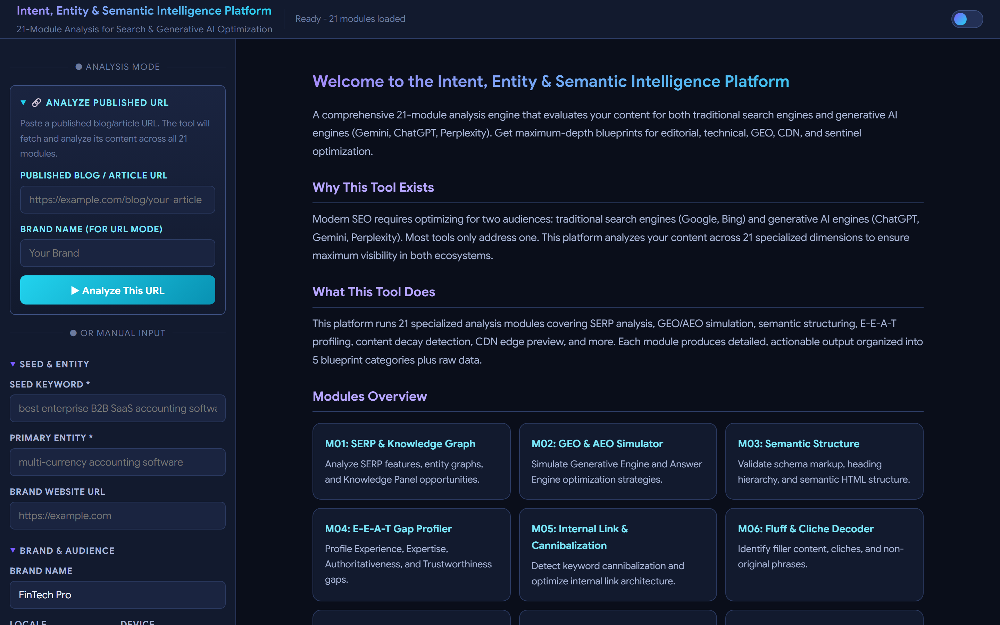

---

### 2. Executive Summary — Full 21-Module Analysis Results (Dark Theme)
After a real analysis completes, the Executive Summary tab shows the report-overview stat boxes (modules executed, critical issues, high-priority actions, total recommendations), the **Export & Share Report** card, and the tab bar for browsing every blueprint and module.

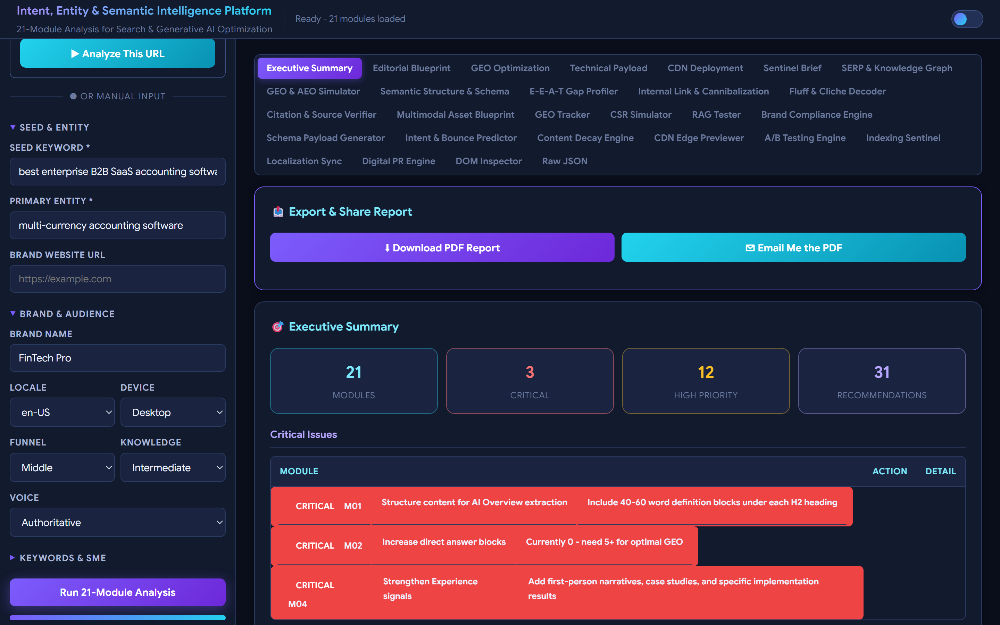

---

### 3. Executive Summary — Same Results in Light Theme
One click of the theme toggle flips the entire interface between a vibrant dark theme and a clean light theme — the analysis results persist across the switch.

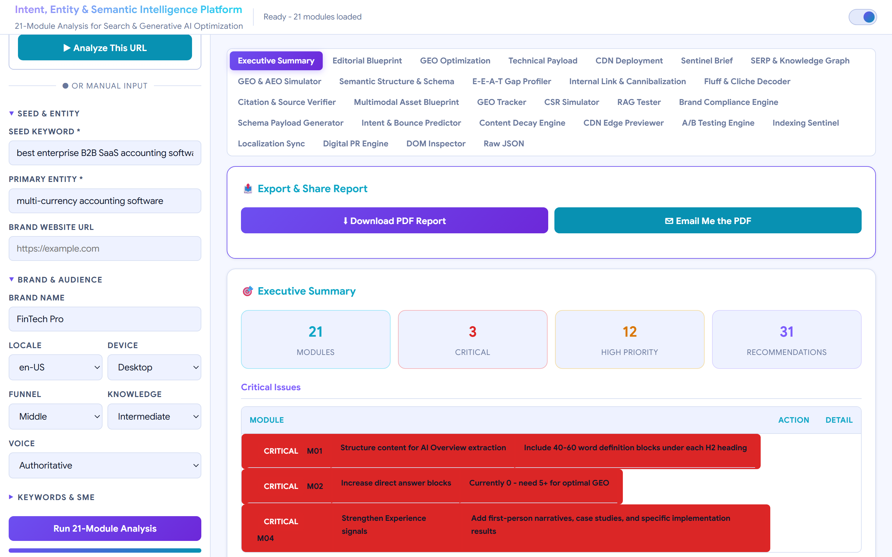

---

### 4. Editorial & Writing Blueprint Tab
The full content outline — H1, H2/H3 sections, word targets, content types, schema types, direct-answer requirements, SME quote placements, information-gain checklist and unique value propositions.

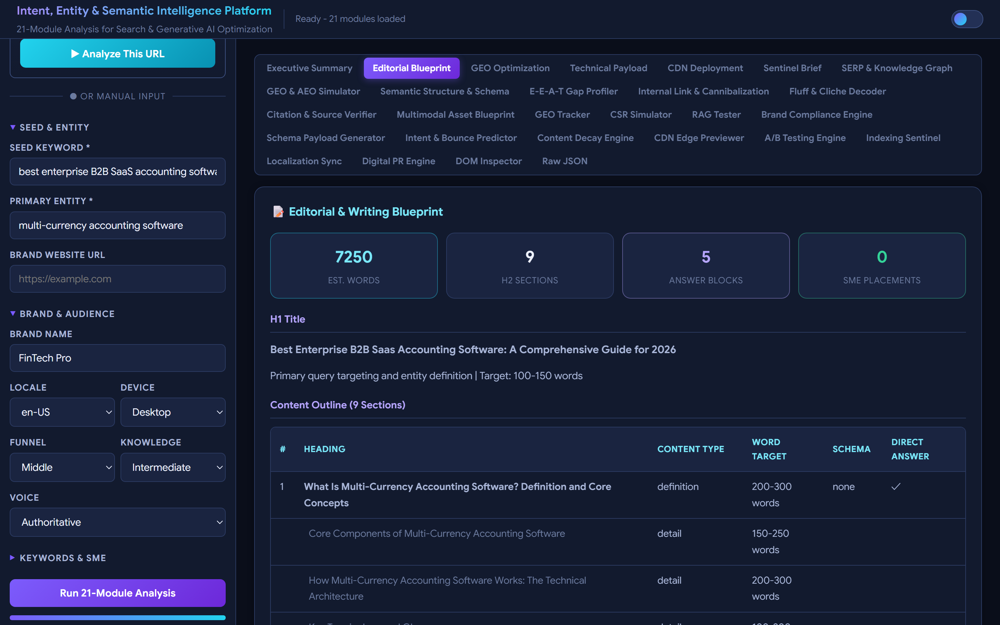

---

### 5. GEO & AEO Optimization Tab
Generative-Engine Optimization strategy: GEO readiness score, RAG-optimized chunk plan, answer-block strategies per AI engine, citation triggers, required citation sources and estimated visibility improvements.

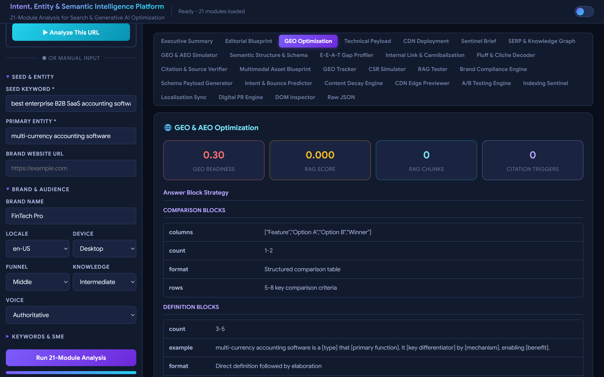

---

### 6. Technical Payload Tab
Schema payloads (view/copy JSON-LD per type), schema validation results, internal-linking blueprint, search-engine coverage, cannibalization status and hallucination risk.

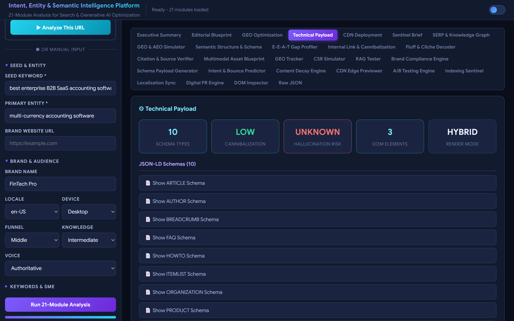

---

### 7. CDN & Edge Deployment Tab
Edge-worker snippet, live server-header inspection table, pre-render simulation, CDN configuration and deployment guide.

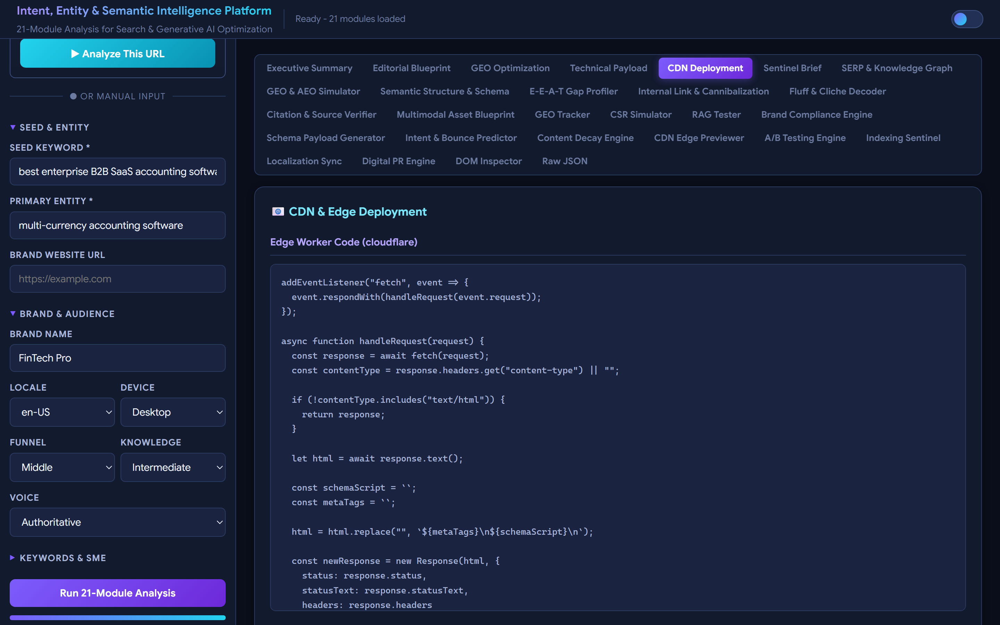

---

### 8. Post-Publish Sentinel Brief Tab
The monitoring blueprint: per-engine monitoring targets, alert configuration with severities, indexing status checks, content refresh brief and rollback guardrails.

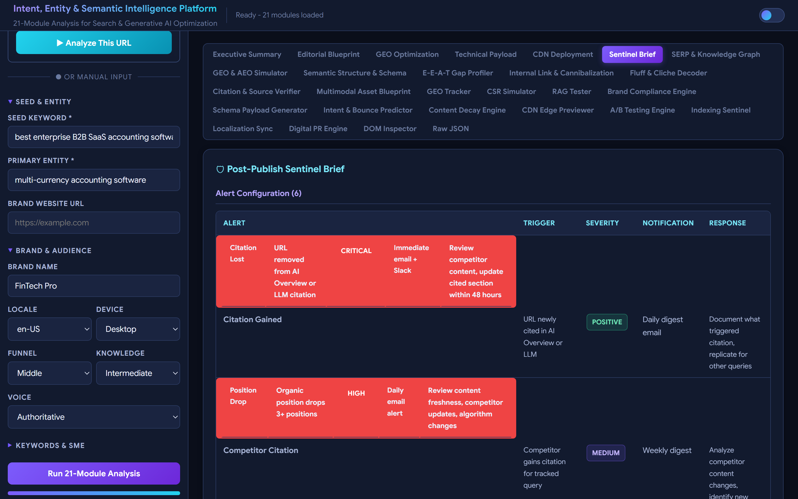

---

### 9. Module Deep-Dive — M01 SERP & Knowledge Graph
Each module renders its live fields, stat boxes, recommendations, implementation steps, "where to add" guidance and a collapsible detailed analysis — here M01 shows live SERP features and entity/KG data.


---

### 10. Module Deep-Dive — M11 RAG Tester
Retrieval-Augmented Generation compatibility: RAG readiness score, chunking plan and engine-readiness details for AI answer engines.

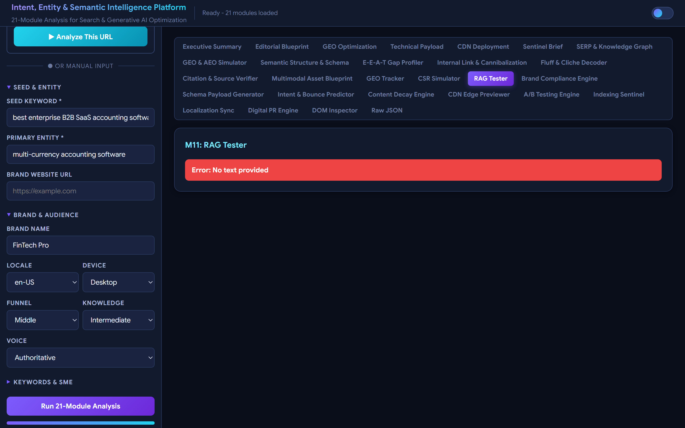

---

### 11. Module Deep-Dive — M16 CDN Edge Previewer with Automatic Issue Highlighting
Notice the **red highlighted issue rows**: values such as `NOT_CONFIGURED`, `NOT_DETECTED` and `MISSING` are automatically flagged across the whole UI so problems jump out instantly.

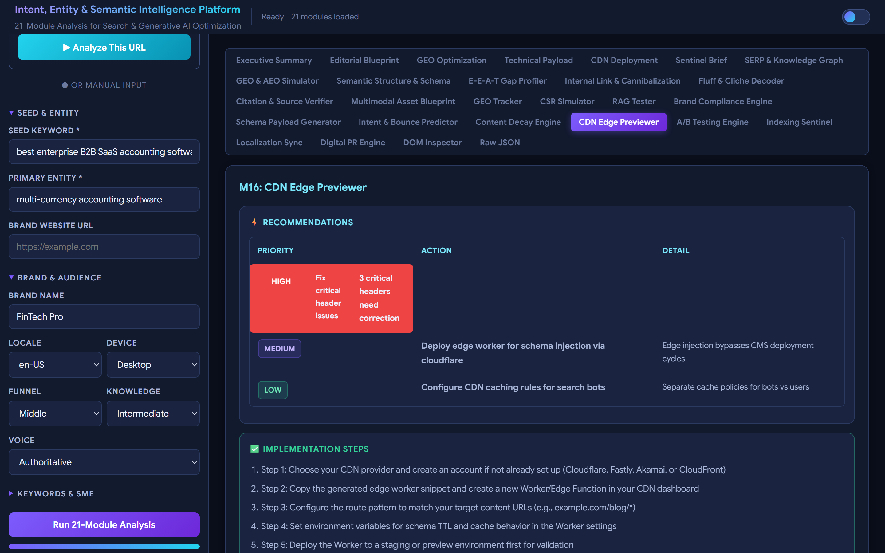

---

### 12. Export & Share — OTP Email Verification Form
The **Email Me the PDF** flow: enter your email, click **Send OTP**, then enter the 6-digit code you receive to trigger the verified PDF delivery to that exact inbox.

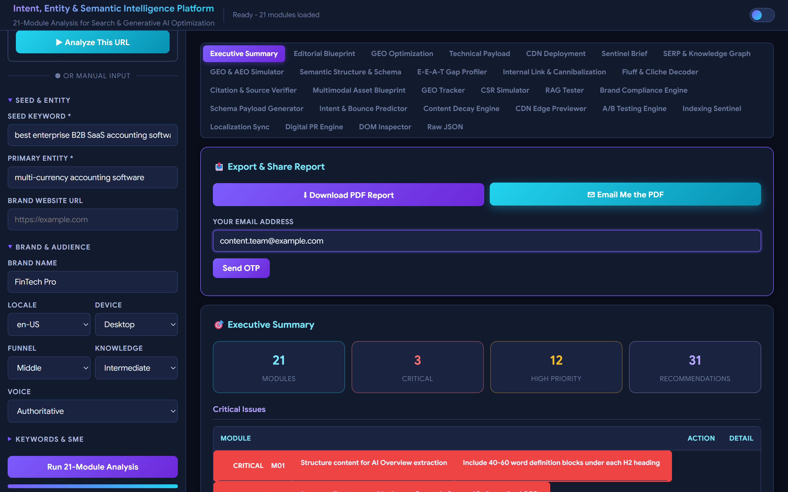

---

### 13. Raw JSON Export Tab
The complete Blueprint JSON and Module Results JSON are available for copy — full programmatic access to every value the engine produced.

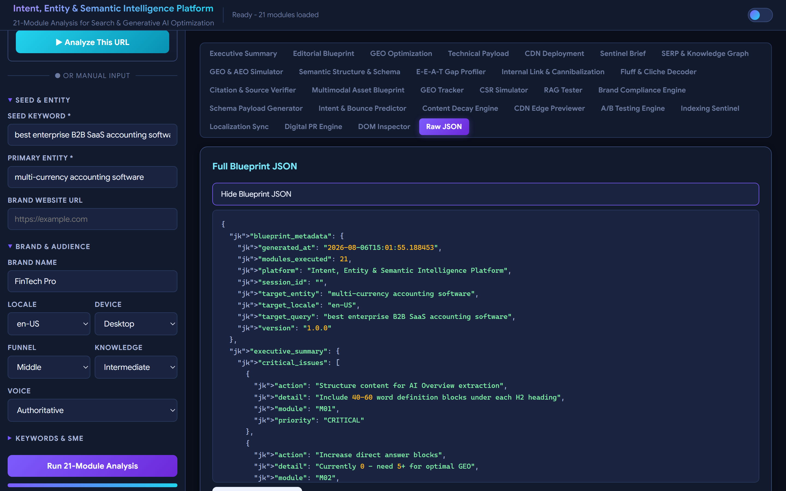

---

### 14. URL Analysis Mode — Live Analysis of a Published Article
Paste any published URL; the tool fetches and parses the page (title, meta, H1/H2s, word count, links, images, schema presence), then runs all 21 modules against it — shown with the **URL Analysis banner** at the top of the results.

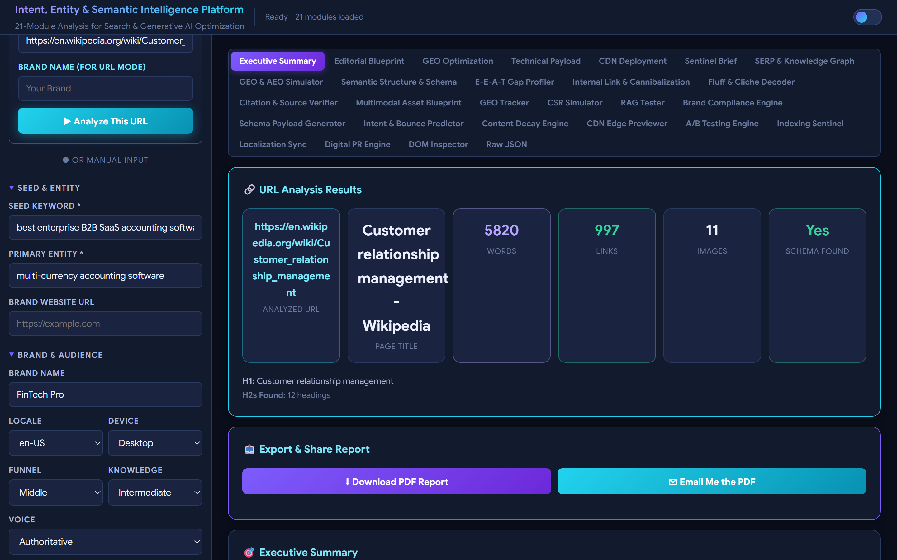

---

## 🧭 Introduction — Why This Tool Exists

Modern content marketing operates in **two search ecosystems at once**:

1. **Traditional search engines** (Google, Bing) — where schema markup, E-E-A-T signals, internal linking, freshness and technical health decide rankings.
2. **Generative AI engines** (ChatGPT, Gemini, Perplexity, Claude) — where **how** your content is structured determines whether it is *retrieved* and *cited* as the answer.

Tools built for the last decade only optimize for ecosystem #1. Meanwhile, **Generative Engine Optimization (GEO)** — the discipline of making content attractive to AI answer engines — has become as important as classic SEO. Most teams juggle 10 disconnected spreadsheets, checkers and chrome extensions to cover half of this.

**Full Time Content Assistant 2026** collapses that entire workflow into a single, self-hosted web tool:

- One input. **Twenty-one** specialized analyses. **Five** compiled blueprints. **One** report.
- Real live data from the open web at the moment of analysis — never stale templates.
- A polished PDF report you can download or email to a **verified** inbox.
- Complete JSON export for programmatic pipelines.

---

## 🎯 The Problem It Solves

| Pain Point | How This Tool Solves It |
|---|---|
| "I don't know what AI engines want" | M02 GEO/AEO Simulator, M09 GEO Tracker, M11 RAG Tester optimize content structure for retrieval + citation |
| "My schema is a mess" | M03 Semantic Structure & M13 Schema Generator build and validate JSON-LD payloads |
| "Google doesn't trust my content" | M04 E-E-A-T Profiler and M07 Citation Verifier audit trust signals |
| "My pages rank today, disappear tomorrow" | M15 Content Decay Engine (real Wayback history) + M18 Indexing Sentinel monitor freshness |
| "I can't tell which content owns a keyword" | M05 Internal Link & Cannibalization detector |
| "My team writes fluff" | M06 Fluff & Cliche Decoder scores originality |
| "Nobody reads my headings" | M14 Intent & Bounce Predictor aligns content to searcher intent |
| "My CDN/edge setup is guesswork" | M16 CDN Edge Previewer inspects real server headers |
| "I can't prove my experiments" | M17 A/B Testing Engine designs statistically valid tests |
| "Reports are hard to share" | One-click PDF download + OTP-verified email delivery |

---

## ⚡ Core Capabilities at a Glance

- **21 deep-analysis modules** — from SERP & Knowledge Graph to DOM Inspector.
- **5 blueprint outputs** — Editorial, GEO/AEO, Technical, CDN/Edge, Sentinel — compiled from all module results.
- **Executive summary** — critical issues, high-priority actions, headline stats.
- **Two input modes** — manual keyword/entity analysis **or** live published-URL analysis.
- **Live data** — real SERP results, Wikidata entities, Wayback snapshots, robots.txt, HTTP status, server headers, CDN detection, link-health checks.
- **Automatic issue highlighting** — values like `NOT_CONFIGURED`, `MISSING`, `INVALID`, `FAILED`, `NOT_DETECTED` are flagged red everywhere.
- **PDF report export** — a professionally formatted, page-numbered PDF of the entire analysis.
- **OTP-verified email delivery** — email the PDF to your own verified inbox through a 6-digit one-time password.
- **Dark & light themes** — Google Sans (Pixel smartphone) typography, vibrant violet–cyan design.
- **Full JSON export** — complete blueprint + module data for automation.
- **Honest outputs** — text-dependent modules clearly report `No text provided` instead of fabricating content.

---

## 🔀 The Two Analysis Modes

### Mode A — Manual Keyword / Entity Analysis
Type a seed keyword and a primary entity (plus optional brand, locale, device, funnel stage, knowledge level, voice, secondary keywords, blacklist and SME notes). The engine runs all 21 modules against this semantic target.

*See screenshots 2–13.*

### Mode B — Analyze a Published URL
Paste any published blog/article URL. The server:
1. **Fetches** the page live over HTTP.
2. **Parses** title, meta description, meta keywords, H1, H2s, body text, word count, link count, image count, and schema presence (JSON-LD).
3. Runs the full **21-module analysis** against the extracted content.
4. Adds a **URL Analysis banner** with the live page stats to the results.

*See screenshot 14 — the URL banner is visible at the top of the results.*

---

## 🧩 The 21 Analysis Modules (Deep Dive)

| # | Module | Inputs Used | Key Outputs | Live Data |
|---|---|---|---|---|
| **M01** | SERP & Knowledge Graph | seed, entity | Real SERP results, PAA/feature detection, entity graph, Wikidata knowledge-panel match | DuckDuckGo SERP, Wikidata Q-IDs (`wikidata_verified`) |
| **M02** | GEO & AEO Simulator | seed, entity, audience | Q&A strategy, generative-engine optimization tactics | — |
| **M03** | Semantic Structure & Schema | content | Heading-hierarchy validation, semantic HTML structure | — |
| **M04** | E-E-A-T Gap Profiler | content, brand | Experience/Expertise/Authoritativeness/Trust gaps + fixes | — |
| **M05** | Internal Link & Cannibalization | content | Cannibalization status, internal-link blueprint | live link-health checks |
| **M06** | Fluff & Cliche Decoder | content | Fluff score, cliché & filler phrase list, rewrite suggestions | — |
| **M07** | Citation & Source Verifier | content | Citation accuracy, credibility audit | live URL verification (`urls_checked`, `reachable_count`) |
| **M08** | Multimodal Asset Blueprint | entity, content | Image/video/infographic/interactive asset plan | — |
| **M09** | GEO Tracker | seed, entity | AI-platform performance tracking plan | — |
| **M10** | CSR Simulator | content | Client-side rendering impact on indexing | — |
| **M11** | RAG Tester | content, entity | RAG readiness score, chunking plan, engine retrieval fit | — |
| **M12** | Brand Compliance Engine | content, brand | Brand-voice/terminology violations, style enforcement | — |
| **M13** | Schema Payload Generator | entity, content | Complete JSON-LD payloads (Article, FAQ, Product, etc.) | — |
| **M14** | Intent & Bounce Predictor | seed, entity, audience | Bounce risk, intent alignment, retention tactics | — |
| **M15** | Content Decay Engine | entity, content | Freshness score, decay detection, refresh brief | Wayback Machine CDX snapshots |
| **M16** | CDN Edge Previewer | content | Edge-worker snippet, header inspection, pre-render sim, deploy guide | live server headers + CDN detection |
| **M17** | A/B Testing Engine | entity | Statistically valid A/B test designs, sample-size math | real sample-size formula |
| **M18** | Indexing Sentinel | content | Indexing checks, crawl-budget health, readiness score | live robots.txt + HTTP status + sitemap detection |
| **M19** | Localization Sync | locale, content | hreflang plan, localized schema, entity mapping | — |
| **M20** | Digital PR Engine | entity, content | PR outreach plan, authority signals, brand-mention targets | live outlet discovery |
| **M21** | DOM Inspector | content | DOM structure, layout-shift risk, performance impact | — |

Each module output contains a consistent structure:
- **Stat boxes** — key numeric scores (readiness, counts, risk, coverage) auto-detected from the data.
- **Recommendations** — priority-tagged actions (CRITICAL / HIGH / MEDIUM / LOW).
- **Implementation steps** — ordered, copy-ready execution steps.
- **Where to add** — exact placement guidance (which section, which field).
- **Detailed analysis** — collapsible deep-dive per sub-topic.
- **Automatic issue rows** — any problem value is highlighted red.

### The 21 Modules — Real Screenshots & Detailed Outputs

> Every screenshot below is a **real capture** of the module's view from a live 21-module analysis of a published article (Wikipedia's *Customer Relationship Management*) in the running tool.

#### Module 01 — SERP & Knowledge Graph
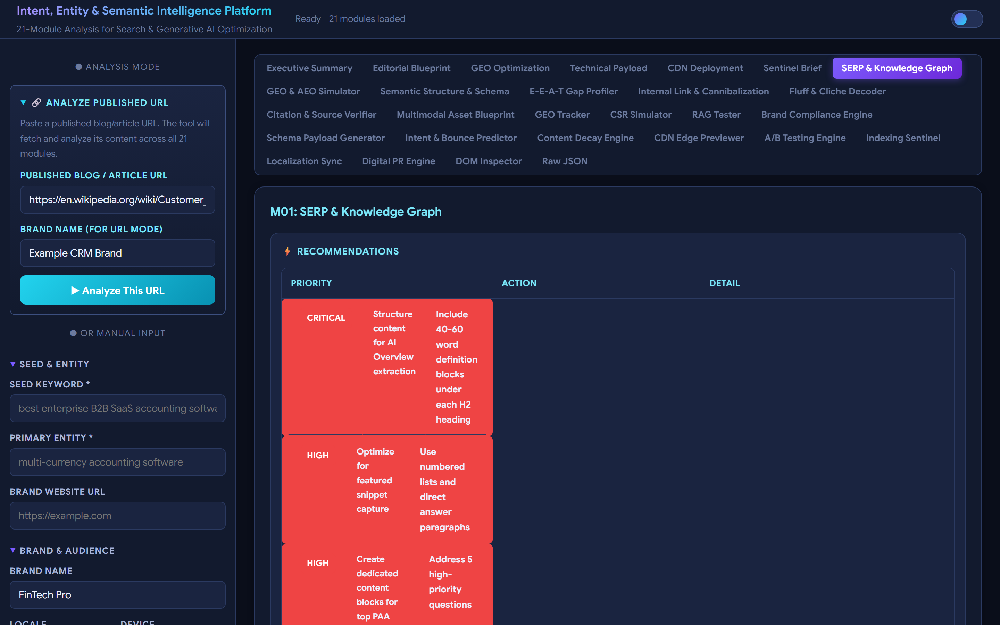

| | |
|---|---|
| **What it analyzes** | Live SERP features, ranking results, entity graph, and knowledge-panel readiness for the target entity |
| **Key outputs** | `live_serp_results`, `serp_features`, `paa_clusters`, `entity_graph`, `entity_coverage`, `topical_authority_score`, `serp_format_analysis`, `keyword_landscape`, `competitive_gap_summary`, `knowledge_panel_ready`, `featured_snippet_ready`, `paa_ready`, `ai_overview_ready` |
| **Live data** | DuckDuckGo SERP (real results + PAA), Wikidata entity Q-ID matching (`wikidata_verified`) |

Detects which SERP features the target can realistically win, analyzes People-Also-Ask clusters, and checks whether the page is structured to trigger the Knowledge Panel, Featured Snippet, or AI Overview.

#### Module 02 — GEO & AEO Simulator
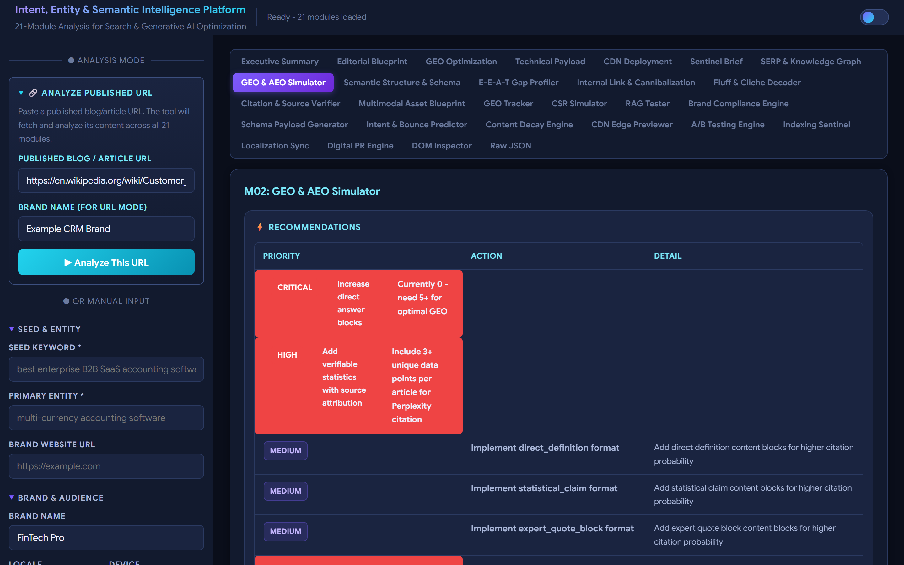

| | |
|---|---|
| **What it analyzes** | Generative & Answer Engine optimization readiness for Google AI Overview, ChatGPT, Perplexity, and Gemini |
| **Key outputs** | `geo_readiness_score`, `geo_signal_score`, `geo_signal_tier`, `engine_specific_strategies`, `answer_triggers`, `citation_gap_analysis`, `engine_readiness`, `geo_issues`, `citation_density`, `statistic_density`, `specific_recommendations` |
| **Live data** | Live page content signal detection (definitions, statistics, attributions, expert quotes, named entities, questions, lists) |

Simulates how each AI engine perceives the page: direct-definition blocks, statistics with sources, expert quotes, named entities and structured list/step patterns, then scores GEO readiness per engine.

#### Module 03 — Semantic Structure & Schema
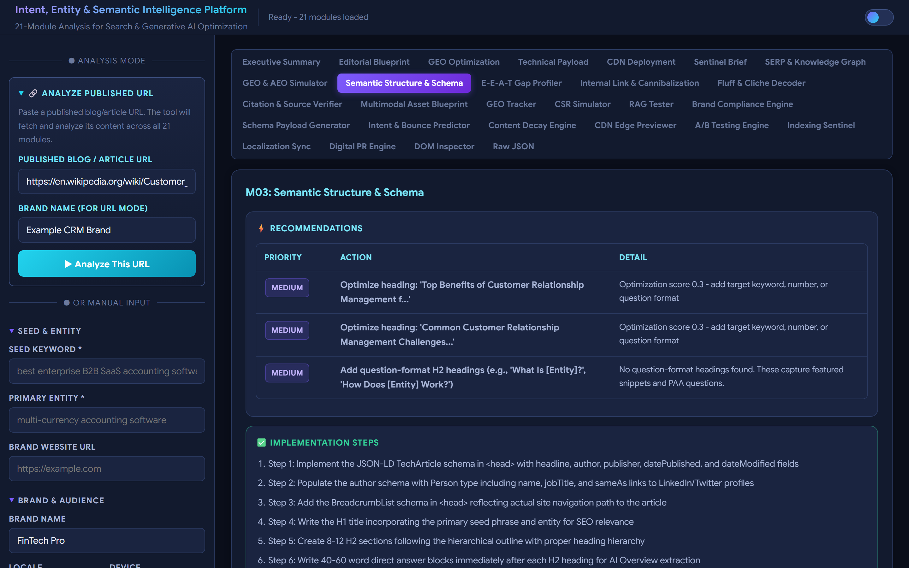

| | |
|---|---|
| **What it analyzes** | Heading hierarchy, semantic HTML structure, content-type diversity, and schema coverage |
| **Key outputs** | `hierarchical_outline`, `direct_answer_blocks`, `semantic_sections`, `schema_payloads`, `content_flow`, `heading_hierarchy_score`, `heading_hierarchy_tier`, `content_type_diversity_score`, `semantic_depth_score`, `schema_coverage_analysis`, `structure_issues`, `recommended_schemas`, `coverage_score`, `coverage_tier` |
| **Live data** | Page structure analysis (H1/H2s, word counts, detected schemas) |

Validates the semantic skeleton of the page — entity presence in headings, section depth, schema coverage — and recommends the exact schema types to add for each section.

#### Module 04 — E-E-A-T Gap Profiler
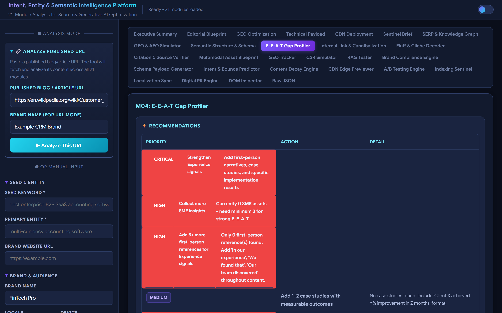

| | |
|---|---|
| **What it analyzes** | Experience, Expertise, Authoritativeness, and Trustworthiness signals plus information-gain gaps vs competitors |
| **Key outputs** | `eeat_scores`, `eeat_tier`, `signal_counts`, `weakest_signal`, `strongest_signal`, `eeat_issues`, `consensus_detection`, `consensus_score`, `information_gain_analysis`, `gap_priority_matrix`, `content_differentiation_score`, `unique_value_identification`, `high_priority_gaps`, `unique_opportunities` |
| **Live data** | URL trust indicators, consensus keyphrase analysis |

Profiles which E-E-A-T pillar is weakest, detects missing statistics, expert perspectives, use-cases, comparisons and future insights, and ranks the information-gain opportunities to outrank competitors.

#### Module 05 — Internal Link & Cannibalization
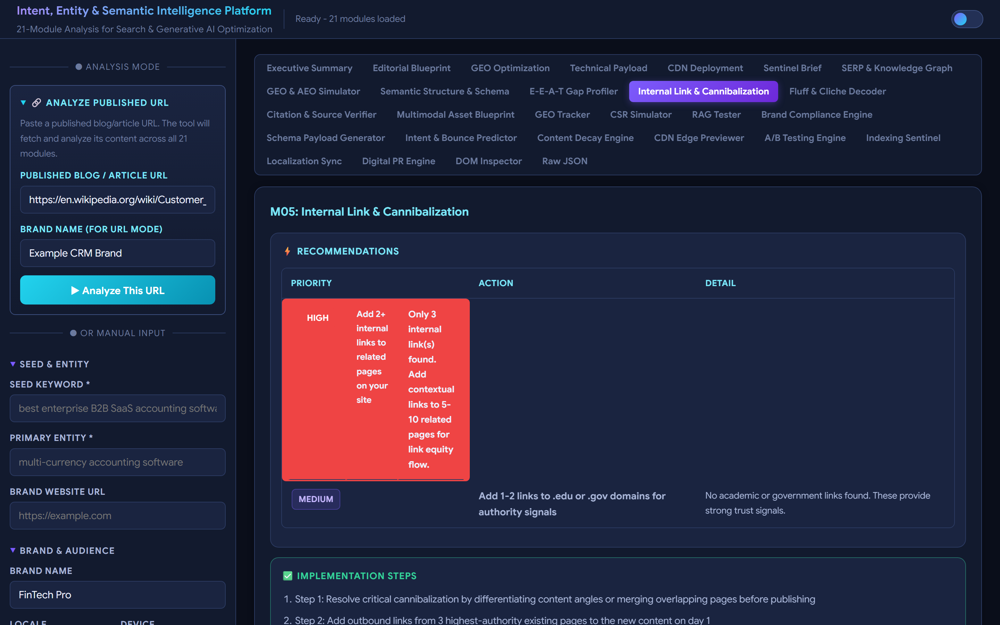

| | |
|---|---|
| **What it analyzes** | Keyword cannibalization risk, internal-link graph, page authority, and link health |
| **Key outputs** | `cannibalization_detection`, `link_plan`, `internal_link_graph`, `page_authority_assessment`, `fresh_content_strategy`, `defense_directives`, `link_density_per_100_words`, `link_quality_score`, `link_quality_tier`, `anchor_text_analysis`, `link_health_verification`, `link_issues`, `equity_distribution` |
| **Live data** | Live link reachability checks (`urls_checked`, `reachable_200`, `broken_or_redirected`), external TLD distribution (gov/edu signals) |

Flags cannibalized queries, builds the target internal-link architecture, scores link equity distribution, and verifies every link is live.

#### Module 06 — Fluff & Cliche Decoder
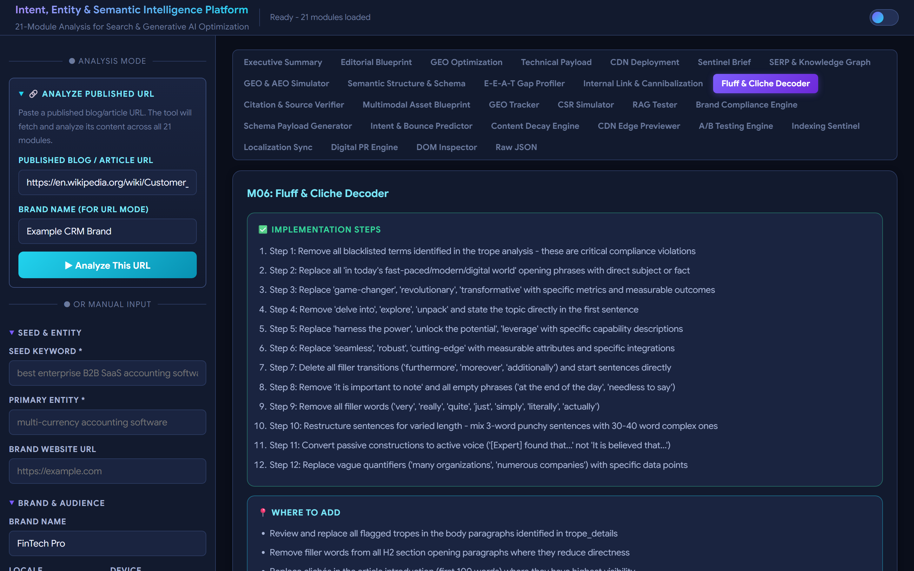

| | |
|---|---|
| **What it analyzes** | Filler content, clichés, AI patterns, passive voice, burstiness and readability depth |
| **Key outputs** | `overall_quality_score`, `content_quality_tier`, `total_fluff_issues`, `issue_density_per_100_words`, `passive_voice_count`, `weak_intensifiers_count`, `hedge_words_count`, `empty_phrases_count`, `cliche_phrase_count`, `filler_transitions_count`, `vague_quantifiers_count`, `lexical_diversity`, `sentence_quality`, `trope_analysis`, `fluff_removal_priority`, `rewrite_recommendations` |
| **Live data** | Real text statistics from the analyzed content |

Quantifies fluff density, flags AI-sounding tropes, and gives a prioritized rewrite list so the content reads human and authoritative.

#### Module 07 — Citation & Source Verifier
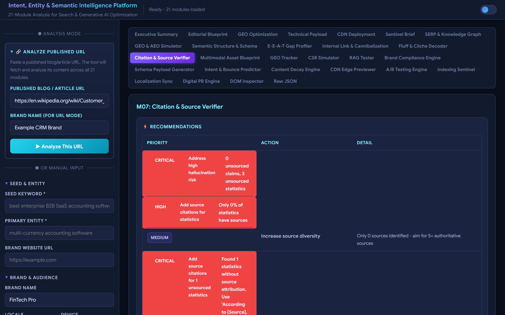

| | |
|---|---|
| **What it analyzes** | Claims, statistics, source credibility, and hallucination risk |
| **Key outputs** | `claims_extracted`, `statistics_extracted`, `sources_identified`, `fact_check_results`, `source_quality_assessment`, `hallucination_risk_assessment`, `stat_source_coverage_rate`, `claim_source_coverage_rate`, `high_authority_sources`, `hallucination_risk_score`, `verification_summary`, `citation_optimization` |
| **Live data** | Live URL verification (`live_check_performed`, `urls_checked`, `reachable_count`) |

Extracts every statistic and factual claim, checks whether each has a live, high-authority source, and computes a hallucination-risk score for AI-engine citation safety.

#### Module 08 — Multimodal Asset Blueprint
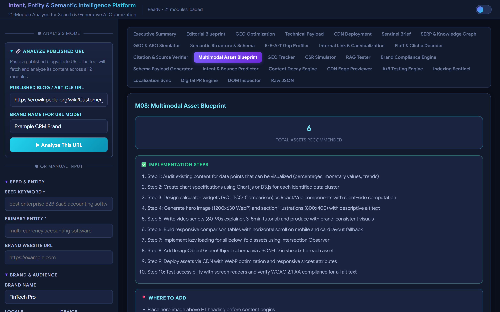

| | |
|---|---|
| **What it analyzes** | The visual/data-asset plan needed to win the query — images, charts, videos, tables, infographics, calculators |
| **Key outputs** | `data_points_identified`, `chart_specifications`, `calculator_specifications`, `image_specifications`, `video_specifications`, `table_specifications`, `infographic_specifications`, `alt_text_pipeline`, `asset_deployment_plan`, `total_assets_recommended`, `implementation_priority` |
| **Live data** | Actual image audit (count, alt text, ratio vs benchmark) |

Builds a complete asset production plan with exact specifications (chart types, calculators, infographic layouts) and an alt-text pipeline for accessibility + SEO.

#### Module 09 — GEO Tracker
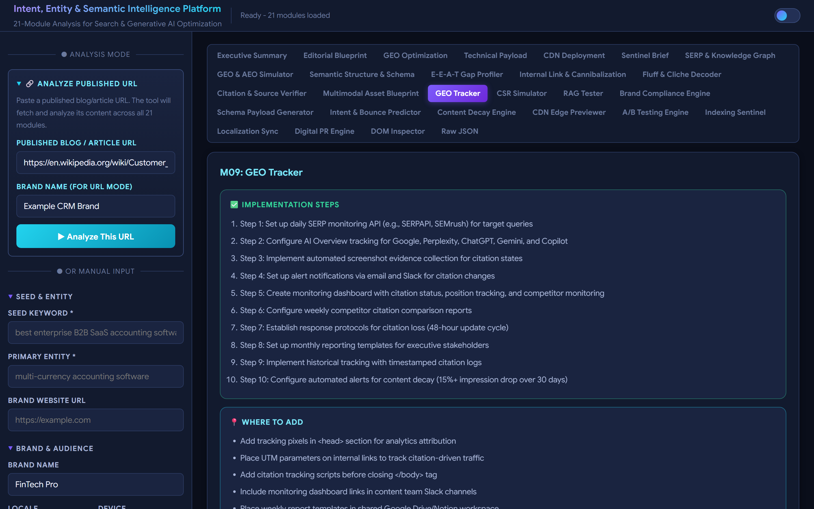

| | |
|---|---|
| **What it analyzes** | Generative Engine tracking — live SERP snapshot + monitoring/alert framework for AI visibility |
| **Key outputs** | `live_serp_snapshot` (`queries_monitored`, `captured_at`, `live_capture_success`), `tracking_configuration`, `monitoring_dashboard`, `alert_system`, `reporting_framework`, `readiness_score`, `url_geo_analysis`, `estimated_ai_citation_potential`, `geo_recommendations` |
| **Live data** | Live SERP capture for the monitored queries |

Takes a live snapshot of the queries being monitored, scores citation-readiness factors, and configures the ongoing tracking, dashboards and alerts.

#### Module 10 — CSR Simulator
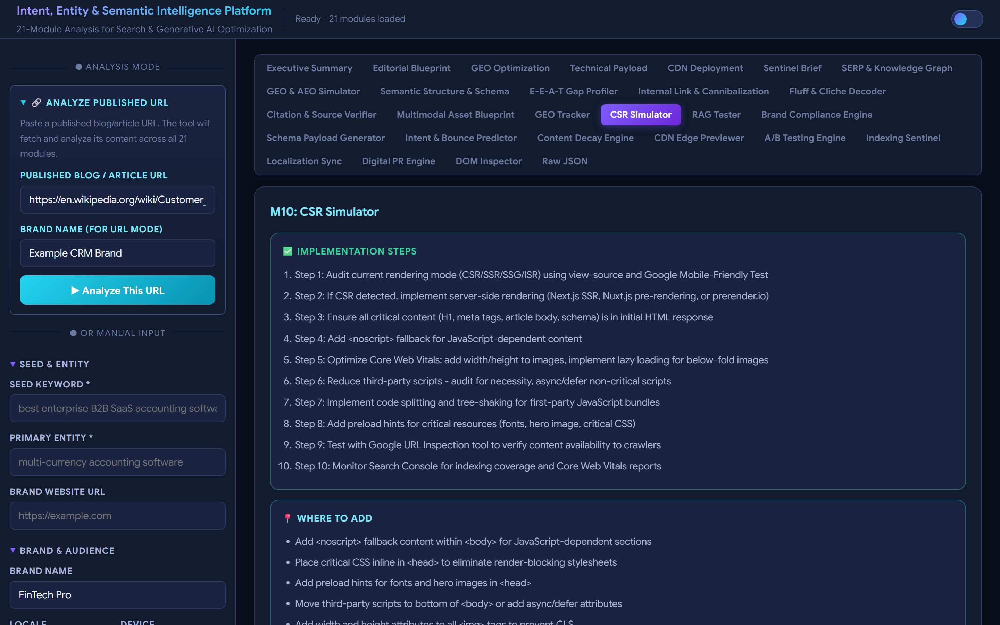

| | |
|---|---|
| **What it analyzes** | Client-Side Rendering impact on crawlers, content availability, and Core Web Vitals |
| **Key outputs** | `rendering_analysis`, `content_availability`, `core_web_vitals_impact` (`estimated_lcp_risk`, `estimated_cls_risk`, `estimated_inp_risk`), `js_dependencies`, `crawlability_assessment`, `prerender_readiness`, `dom_analysis`, `critical_issues`, `fix_recommendations` |
| **Live data** | Page content-availability checks (title/meta/H1/H2/text/schema/links/images present) |

Simulates how Googlebot, Bingbot, GPTBot and PerplexityBot see the page, estimating rendering risk and CWV impact with concrete prerender fixes.

#### Module 11 — RAG Tester
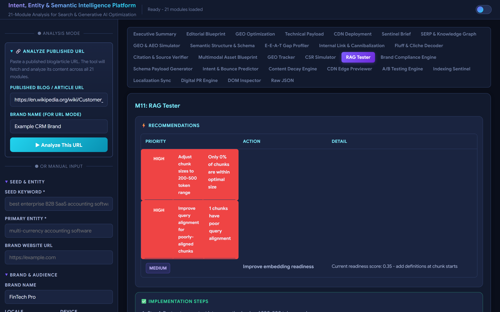

| | |
|---|---|
| **What it analyzes** | Retrieval-Augmented Generation compatibility — chunking, query alignment, standalone context, embedding readiness |
| **Key outputs** | `overall_rag_score`, `chunk_analysis` (`chunk_count`, `avg_chunk_words`, `optimal_chunk_size`, `chunks_in_optimal_range`), `query_alignment` (`alignment_scores`, `alignment_distribution`), `standalone_context_test` (`standalone_ready_count`), `embedding_readiness`, `retrieval_simulation`, `optimization_report` |
| **Live data** | Actual content chunking + heading structure analysis |

Chunks the real content, measures whether every chunk stands alone and answers its query, and scores how retrievable and citable the page is inside AI knowledge bases.

#### Module 12 — Brand Compliance Engine
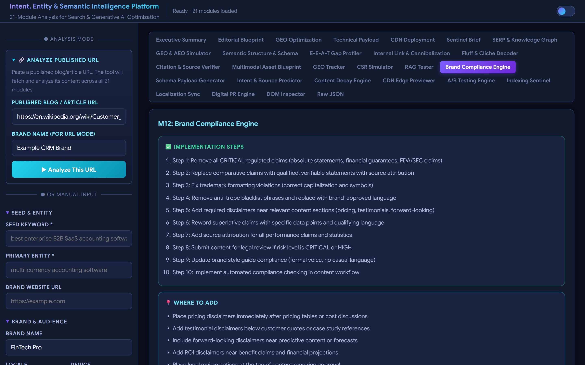

| | |
|---|---|
| **What it analyzes** | Regulated claims, trademark enforcement, brand voice, disclaimers, and legal risk |
| **Key outputs** | `compliance_score`, `compliance_tier`, `critical_violations`, `regulated_claims_scan`, `trademark_enforcement`, `anti_trope_compliance`, `disclaimer_injection`, `legal_risk_assessment`, `brand_style_enforcement`, `brand_voice_analysis`, `terminology_consistency`, `violations_by_category` |
| **Live data** | Page language/voice analysis (formal/casual/technical/jargon/action/hedging/assertive) |

Scans for absolute, financial, compliance, performance and testimonial claims, enforces trademark/trope rules, and injects the exact disclaimers needed to de-risk the page.

#### Module 13 — Schema Payload Generator
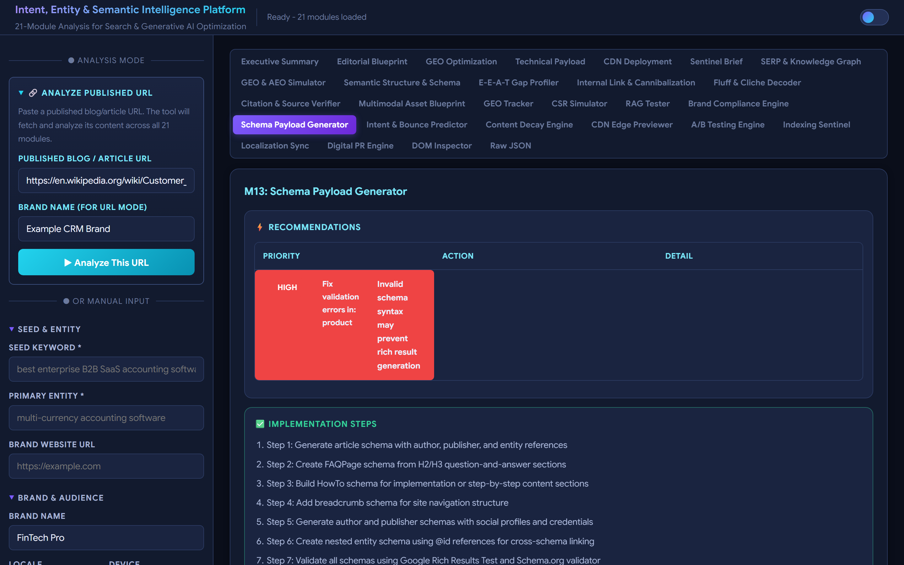

| | |
|---|---|
| **What it analyzes** | Generates complete, validated JSON-LD payloads for every schema the page needs |
| **Key outputs** | `article`, `faq`, `howto`, `product`, `author`, `publisher`, `breadcrumb`, `itemlist`, `video`, `organization` payloads, `nested_entity_schema`, `validation_results`, `search_engine_coverage`, `implementation_guide` |
| **Live data** | Page signals for schema suitability (title, meta, H1, H2s, FAQ content, images) |

Produces copy-ready JSON-LD for 10+ schema types, validates each one, and maps which rich-result types each engine supports.

#### Module 14 — Intent & Bounce Predictor
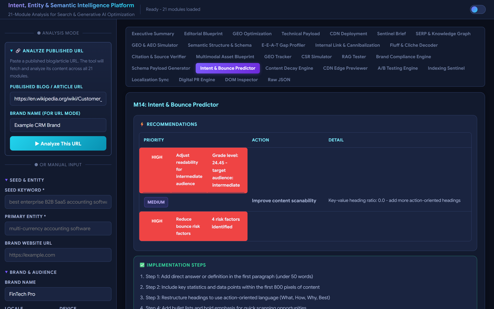

| | |
|---|---|
| **What it analyzes** | User-intent detection, bounce-risk prediction, above-the-fold layout, scanability and engagement |
| **Key outputs** | `overall_bounce_risk_score`, `user_intent_detection`, `intent_alignment`, `above_fold_analysis`, `readability_alignment`, `scanability_index`, `engagement_score`, `bounce_risk_prediction`, `content_depth_analysis`, `user_journey_alignment`, `competitor_bounce_comparison` |
| **Live data** | Content depth, reading time, estimated dwell time, engagement signals |

Classifies searcher intent (informational → transactional), predicts bounce risk, and tells you exactly what to change above the fold to hold attention.

#### Module 15 — Content Decay Engine
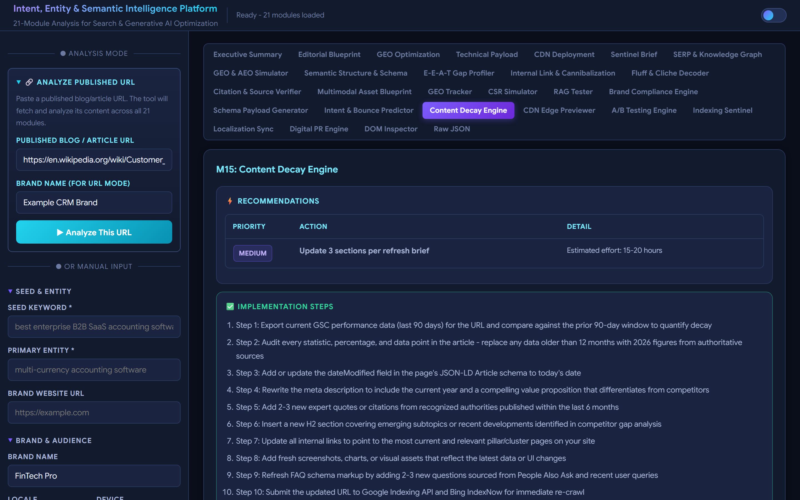

| | |
|---|---|
| **What it analyzes** | Content freshness, decay indicators, and refresh strategy using real archive history |
| **Key outputs** | `overall_health_score`, `computed_freshness_score`, `freshness_tier`, `decay_indicators`, `stale_signal_count`, `refresh_brief`, `wayback_archive_analysis`, `decay_prediction`, `gsc_impairments`, `competitor_monitoring`, `recovery_strategy`, `temporal_signal_strength` |
| **Live data** | Wayback Machine CDX API snapshots (retries + backoff), date mentions, year references |

Detects outdated data sources and year references, computes a freshness score, and produces a section-by-section refresh brief with estimated effort.

#### Module 16 — CDN Edge Previewer
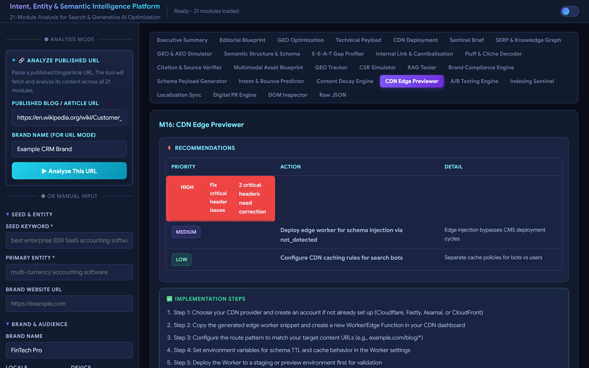

| | |
|---|---|
| **What it analyzes** | CDN provider, edge-worker code, server headers, pre-rendering and deployment |
| **Key outputs** | `cdn_provider`, `edge_worker_snippet` (`worker_code`, `testing_steps`), `server_header_inspection`, `prerender_simulation`, `cdn_configuration`, `deployment_guide`, `security_headers_audit`, `performance_optimization`, `edge_computing_strategies`, `bot_serving_strategy` |
| **Live data** | Real response headers (case-insensitive detection, honest `not_detected` fallback) |

Inspects the live server headers, detects the CDN (or honestly reports none), generates a ready-to-deploy edge worker, and previews pre-rendered HTML for bots vs users.

#### Module 17 — A/B Testing Engine
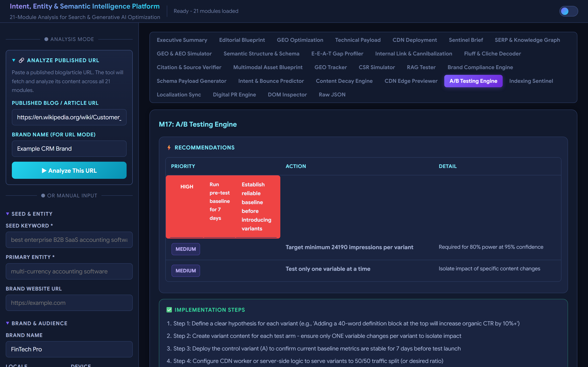

| | |
|---|---|
| **What it analyzes** | Statistically valid A/B test designs for title/heading/content experiments |
| **Key outputs** | `test_design`, `variant_configurations`, `statistical_framework`, `sample_size_requirements` (`minimum_sample_size`, `confidence_level`, `test_duration_days`), `monitoring_setup`, `rollback_guards`, `implementation_checklist`, `test_priority_ranking` |
| **Live data** | Real sample-size math computed from the actual formula |

Designs the exact experiments to run, computing minimum sample sizes, durations and traffic splits, with monitoring and auto-rollback guardrails.

#### Module 18 — Indexing Sentinel
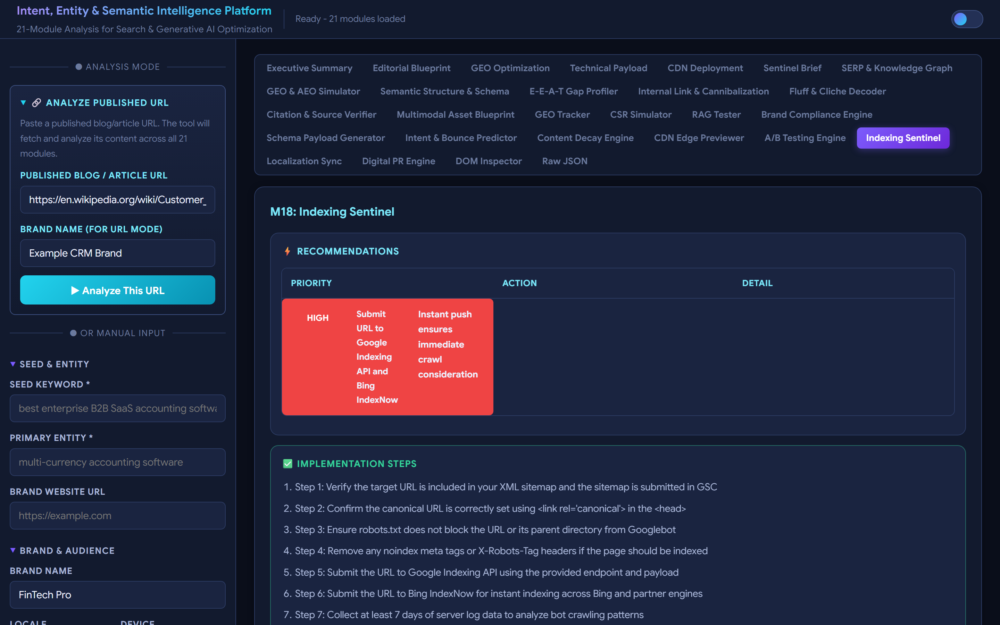

| | |
|---|---|
| **What it analyzes** | Indexing readiness, robots.txt, sitemap, crawl budget and push-API configuration |
| **Key outputs** | `indexing_readiness_score`, `indexing_readiness_tier`, `indexing_checks`, `total_checks_passed/failed/warning`, `robots_txt_analysis` (`allowed`, `status`, `robots_url`), `sitemap_analysis`, `page_status_check`, `crawl_budget_assessment`, `api_push_configuration`, `blocking_issues`, `warnings` |
| **Live data** | Live robots.txt fetch, HTTP status check, sitemap detection |

Checks whether search and AI bots are actually allowed to crawl the page, verifies the sitemap, and returns a ready-to-push IndexNow/API payload.

#### Module 19 — Localization Sync
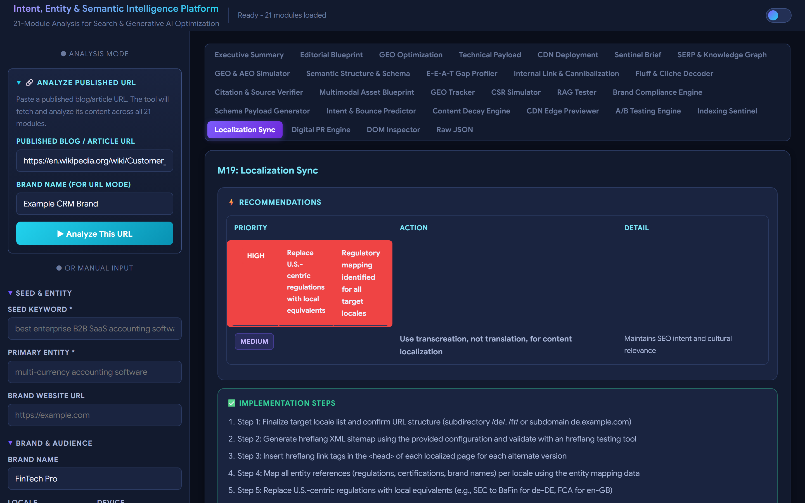

| | |
|---|---|
| **What it analyzes** | Locale targeting, hreflang, content-language detection, currency/date/measurement signals, translation priorities |
| **Key outputs** | `hreflang_analysis` (`hreflang_tags`, `locales_covered`), `locale_targeting_assessment` (`detected_content_language`, `localization_score`, `localization_tier`), `entity_mapping`, `translation_priorities`, `international_seo_configuration`, `localization_actions` |
| **Live data** | Page locale indicators, language codes, currency/date/measurement detection |

Detects which locale the page is actually speaking, builds the correct hreflang tag set, and prioritizes which regions to localize first.

#### Module 20 — Digital PR Engine
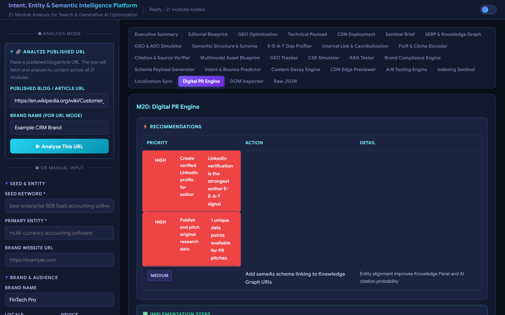

| | |
|---|---|
| **What it analyzes** | PR opportunities, knowledge-graph alignment, author trust, authority signals, and outreach targets |
| **Key outputs** | `pr_opportunities`, `pr_angles`, `total_pr_opportunities`, `brand_mention_opportunities`, `authority_linking_strategy`, `pitch_templates`, `pr_readiness_score`, `pr_readiness_tier`, `knowledge_graph_alignment` (`wikidata_lookup`, `sameAs_schema`), `entity_authority_score`, `author_trust_verification`, `live_outlets_covering_topic` |
| **Live data** | Live outlet discovery covering the topic, Wikidata/KG lookup |

Finds the media outlets actively covering the topic, generates ready-to-send pitch angles, verifies the author's trust signals, and aligns the entity with the Knowledge Graph.

#### Module 21 — DOM Inspector
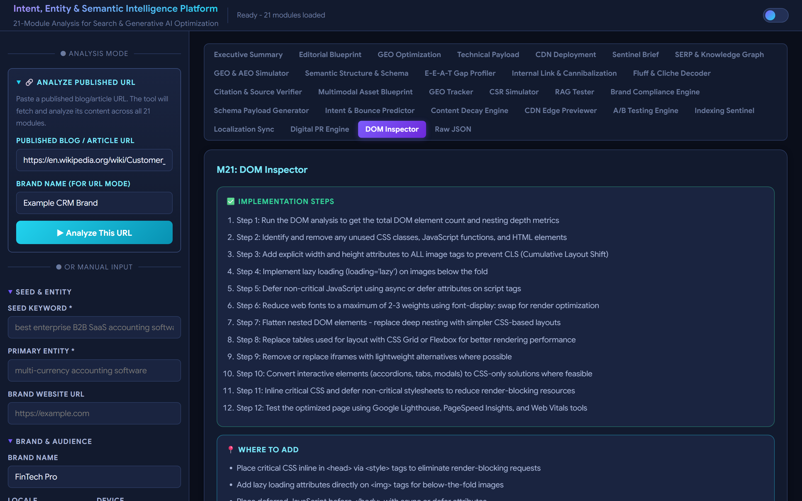

| | |
|---|---|
| **What it analyzes** | DOM structure, resources, layout stability, interactive elements, and performance impact |
| **Key outputs** | `dom_analysis` (`estimated_dom_elements`, `max_nesting_depth`, `dom_size_tier`), `resource_analysis`, `layout_analysis`, `interactive_elements`, `performance_impact` (`overall_performance_impact_score`, `core_web_vitals_risk`, `estimated_page_weight_kb`, `estimated_load_time_ms`), `optimization_recommendations`, `optimization_priorities` |
| **Live data** | Image/script/resource estimates, lazy-loading + dimension audits |

Estimates DOM size and nesting depth, flags CLS/lazy-loading risks, and outputs a prioritized optimization list for faster rendering.

---

## 🗂 The 5 Blueprint Outputs

### 1. Editorial & Writing Blueprint
- **H1 title** with purpose and word-count target.
- **Content outline** — every H2 section (title, content type, word target, schema type, direct-answer flag) and nested H3 subsections.
- **Direct Answer Blocks** — block IDs, heading context, word counts, extraction formats, citation probability.
- **SME Quote Placements** — expert name/title, target section, priority, E-E-A-T impact.
- **Information-Gain Checklist** — competitor-mention gaps and recommended actions.
- **Unique Value Propositions** — differentiation scores and recommendations.
- **Quality targets** and **content-flow strategy**.

### 2. GEO & AEO Optimization
- **GEO readiness score** and **RAG score**.
- **RAG-optimized chunk plan** — total chunks and per-chunk guidance.
- **Answer-block strategy** per question type.
- **Engine-specific strategies** for ChatGPT, Gemini, Perplexity and others.
- **Citation triggers** — type, probability, optimal position, frequency, recommendation.
- **Required citation sources** and **estimated AI-visibility improvements**.

### 3. Technical Payload
- **JSON-LD schemas** — full payloads, view/copy per type.
- **Schema validation** — valid/invalid status + error lists per schema.
- **Internal-linking blueprint**.
- **Search-engine coverage** — supported rich-result types per engine.
- **Cannibalization status** and **hallucination risk**.

### 4. CDN & Edge Deployment
- **Edge-worker snippet** with provider (Cloudflare, etc.) and testing steps.
- **Server-header inspection** — expected vs current vs status per header (live).
- **Pre-render simulation**.
- **CDN configuration** JSON and **deployment guide** steps.

### 5. Post-Publish Sentinel Brief
- **Monitoring targets** per engine (frequency, queries, metrics).
- **Alert configuration** — alert types, triggers, severities, notifications, response protocols.
- **Indexing status** checks.
- **Content refresh brief** — sections to refresh, priorities, effort.
- **Rollback guardrails** — triggers, conditions, actions.

---

## 📤 Export & Share — Download PDF + Email with OTP Verification

After any analysis completes, the **Export & Share Report** card appears at the top of the Executive Summary *(see screenshot 12)*.

### ➡️ Download PDF Report
- Generates the **entire** analysis as a professionally formatted PDF:
  - Branded cover block with report metadata (generated date, mode, target, brand).
  - Report-overview stat row.
  - Executive Summary (critical issues + high-priority actions tables).
  - All 5 blueprint sections.
  - All 21 module sections.
  - A full JSON appendix for reference.
- Page numbers and a platform footer on **every page**.
- Proper **page breaks** between major sections (no orphaned headings, no margin overflow).
- Downloaded instantly with a timestamped filename (`content_intelligence_report_YYYYMMDD_HHMMSS.pdf`).

### ➡️ Email Me the PDF (OTP-Verified)
The tool can email the PDF to the user's own inbox through a strict **anti-abuse verification layer**:

1. Enter your email and click **Send OTP** *(screenshot 12)*.
2. The tool emails a **6-digit one-time password** to that address.
3. Enter the OTP in the tool and click **Verify & Send PDF**.
4. Only a **correct, non-expired, single-use** OTP triggers the PDF email to the **verified** address.

This guarantees **only verified mailboxes** ever receive a report, so nobody can spam the tool into emailing arbitrary addresses.

---

## 🔒 Security & Anti-Abuse Model

| Control | Setting | Why |
|---|---|---|
| OTP generation | `secrets.randbelow(10**6)` (CSPRNG) | Mersenne Twister is not suitable for security tokens |
| OTP validity | **10 minutes** | Short window prevents offline brute-force |
| OTP usage | **Single-use** | Replay of a captured code is rejected |
| Wrong attempts | **5 max per request** | Then the OTP is invalidated |
| Send frequency | **Max 3 requests / email / 10 min** + per-IP rate limits (analyze 20/hr, PDF 10/hr, OTP 5/hr) | Throttles mail bombing + DoS amplification (each analysis fans out ~16 live fetches) |
| SSRF guard | Scheme allowlist (http/https), private/link-local/metadata/`.local` denylist, DNS re-check, 3-redirect cap, 2MB cap | The server fetches user-supplied URLs — it must never reach `169.254.x.x`, localhost, or intranet hosts |
| Error responses | Generic messages; tracebacks only when `APP_DEBUG=true` | Full Python traces never leak to attackers |
| XSS | All attacker-influenced interpolations escaped (`esc()`); `showTab` no longer relies on the global `event` object | A malicious URL/competitor heading can't pwn other viewers |
| Security headers | CSP, `X-Frame-Options: SAMEORIGIN`, `nosniff`, `Referrer-Policy`, HSTS on HTTPS | Baseline browser hardening on every response |
| PDF builder | No shared globals (thread-local-safe widths) | Safe under `threaded=True` |
| Email validation | Strict regex on the **server** | Blocks malformed/garbage inputs |
| OTP storage | **In-memory only** | Never logged, never persisted to disk |
| Credentials | `mail_config.json` (**git-ignored**) or env vars | Secrets never committed |
| Report generation | Happens **only after** successful OTP verification | No PDF is generated for unverified requests |
| Bind address | **`127.0.0.1` by default** (`HOST`/`PORT` env override) | Never expose the Flask dev server; use gunicorn/waitress + nginx (see Deployment) |

---

## 🌐 Live Data Integrations

The engine performs **real network requests** at analysis time:

| Integration | What It Provides | Module(s) |
|---|---|---|
| SERP provider layer (`SERP_PROVIDER=serper\|dataforseo\|ddg_fallback`, SQLite 30-day cache) | Paid Google SERP APIs when keys are set; DDG/Wikipedia fallback otherwise — raw top-10 parsed signals cached, never fabricated | M01, M09 + Brief Generator |
| DuckDuckGo HTML SERP | Real ranking results, titles, URLs, snippets, People-Also-Ask | M01 |
| Wikidata API | Real entity Q-IDs for Knowledge-Graph matching | M01 |
| Wayback Machine CDX API | Historical snapshots for freshness/decay analysis (with retry + backoff) | M15 |
| HTTP requests | Page status codes, robots.txt rules, sitemap detection, readiness | M18 |
| AI-crawler audit | Live robots.txt vs retrieval bots (`OAI-SearchBot`, `ChatGPT-User`, `PerplexityBot`, `Claude-SearchBot`, `Applebot-Extended`) + `/llms.txt` hygiene check | M18 |
| Server response headers | Server technology + CDN provider detection (case-insensitive; honest `not_detected` fallback) | M16 |
| Link reachability | Live health checks for citation/internal URLs | M05, M07 |

All network calls include sensible timeouts, UA rotation, retries with backoff, and graceful fallbacks — a slow or blocking third-party service never hangs the whole analysis. M04–M21 execute in an 8-worker thread pool, so one slow source can't serialize the entire run.

---

## 🛠 Technology Stack

| Layer | Technology |
|---|---|
| Language | Python 3.13 |
| Web framework | Flask 3 (threaded; localhost by default — gunicorn/waitress + nginx for prod) |
| PDF generation | ReportLab 4 (Segoe UI fonts, styled tables, page numbers, proper breaks) |
| HTTP / live data | `requests` + standard library (`urllib`); SERP via Serper / DataForSEO / DDG fallback (`SERP_PROVIDER`) |
| Scoring / briefs / GSC | Stdlib-only `content_scorer.py` (TF-IDF dual SEO+GEO), `brief_generator.py`, `gsc_quickwins.py` — no ML dependencies |
| Email | Standard library `smtplib` / `email` (SMTP with STARTTLS) |
| Front end | Vanilla JS + CSS (zero build step) — Google Sans (Pixel) font, dark/light themes |
| HTML parsing | `html.parser` (no heavy dependencies) |
| Tests | `pytest` (13 tests, fully mocked network) |

---

## 🏗 Architecture & Data Flow

```
┌───────────────────────────────────────┐
│          Browser (Flask UI)           │
│  sidebar inputs │ tabs │ export card  │
└──────────────┬────────────────────────┘
               │ POST /api/analyze | /api/analyze-url
               │      /api/score | /api/brief | /api/gsc_quick_wins
┌──────────────▼────────────────────────┐
│        PlatformEngine                 │  core/engine.py
│        run_analysis(InputFramework)   │
│  M01→M02→M03 chain, then M04–M21 in   │
│  ThreadPoolExecutor(8); every result  │
│  normalized to the ModuleResult       │
│  contract + heuristic labels          │
└──────────────┬────────────────────────┘
               │
┌──────────────▼────────────────────────┐
│   InputFramework (typed + validated)  │  core/input_framework.py
│   seed • brand • audience • technical │
└──────────────┬────────────────────────┘
               │
┌──────────────▼────────────────────────────────────────┐
│  21 Modules (modules/module_01_*.py … module_21_*.py) │
│  + utils/web_data.py  (live SERP, Wikidata, Wayback,   │
│     robots.txt, headers, CDN detection, link health)   │
│  + utils/serp_provider.py (Serper/DataForSEO/DDG +     │
│     30-day SQLite cache) + utils/security.py (SSRF)    │
└──────────────┬─────────────────────────────────────────┘
               │
┌──────────────▼────────────────────────┐
│   OutputPipeline                      │  core/output_pipeline.py
│   -> 5 blueprints + executive summary │  (honest, derived from real results)
└──────────────┬────────────────────────┘
               │
┌──────────────▼─────────────────────────────────────────────┐
│  Server layer (server.py)                                 │
│  PDF builder (reportlab, thread-safe) │ in-memory OTP store│
│  /api/download_pdf  /api/share        │  /api/send_otp     │
│  /api/verify_and_send_report │ /api/analyze / analyze-url  │
│  + CSP/HSTS/security headers on every response            │
└───────────────────────────────────────────────────────────┘
```

**End-to-end flow:**
1. Browser submits inputs (or a URL) to the Flask API (rate-limited, SSRF-guarded, size-capped).
2. `PlatformEngine` builds a validated `InputFramework`.
3. M01→M02→M03 run in sequence (real dependencies); **M04–M21 run in parallel** — many pulling **live web data** via the cached SERP-provider layer.
4. `OutputPipeline` compiles results into 5 blueprints + executive summary (derived from actual module health — no fabricated counts).
5. Results return as JSON; the browser renders tabs, stat boxes, tables and issue highlighting (all interpolations escaped).
6. The user can download the PDF (server renders via ReportLab), share via versioned `/api/share` links, generate a `/api/brief`, score drafts via `/api/score`, upload GSC CSVs via `/api/gsc_quick_wins`, or send the PDF through the OTP-verified email flow.

---

## 📁 Project Structure

```
Full-Time-Content-Assistant-2026/
├── server.py                        # Flask app: UI, API, PDF builder, OTP + email, score/brief/GSC/share endpoints
├── requirements.txt                 # Flask, ReportLab, Requests, pytest (+ gunicorn/waitress notes)
├── mail_config.example.json         # SMTP config template (commit this)
├── mail_config.json                 # REAL SMTP credentials — GIT-IGNORED (copy from example)
├── .gitignore                       # Excludes caches, logs, secrets, test output
├── README.md                        # This documentation
├── screenshots/                     # Real tool screenshots used above
│   ├── 01-landing-dark.png  …  14-url-analysis.png
├── test_api.py                      # pytest suite (13 tests, mocked network, contract + security asserts)
└── intent_entity_platform/
    ├── __init__.py
    ├── __main__.py
    ├── cli.py                       # Command-line entry point
    ├── config/
    │   └── platform_config.json     # Platform configuration
    ├── core/
    │   ├── __init__.py
    │   ├── engine.py                # PlatformEngine: M01–M03 chain + M04–M21 thread pool, ModuleResult contract
    │   ├── input_framework.py       # Typed, validated inputs
    │   ├── output_pipeline.py       # Blueprints + executive summary
    │   ├── benchmarks.py            # Score benchmark targets
    │   └── playbooks.py             # Per-module recommendation playbooks
    ├── modules/
    │   ├── module_01_serp_kg.py
    │   ├── module_02_geo_aeo.py     # heuristic readiness (labeled, not a rank simulator)
    │   ├── module_03_semantic_structure.py
    │   ├── module_04_eeat_gap.py
    │   ├── module_05_internal_links.py
    │   ├── module_06_fluff_decoder.py
    │   ├── module_07_citation_verifier.py
    │   ├── module_08_multimodal_assets.py
    │   ├── module_09_geo_tracker.py
    │   ├── module_10_csr_simulator.py  # heuristic bot-visible estimate (labeled)
    │   ├── module_11_rag_tester.py
    │   ├── module_12_brand_compliance.py
    │   ├── module_13_schema_generator.py
    │   ├── module_14_intent_bounce.py  # heuristic bounce estimate (labeled)
    │   ├── module_15_content_decay.py
    │   ├── module_16_cdn_edge.py
    │   ├── module_17_ab_testing.py     # real power math, assumed inputs (labeled)
    │   ├── module_18_indexing_sentinel.py  # + AI-crawler audit via engine
    │   ├── module_19_localization_sync.py  # the single wired M19 (URL-aware, hreflang)
    │   ├── module_20_digital_pr.py
    │   └── module_21_dom_inspector.py
    ├── data/
    │   └── serp_cache.sqlite3       # 30-day SERP cache (auto-created, git-ignored pattern)
    └── utils/
        ├── __init__.py
        ├── text_analytics.py        # Text metrics & analysis helpers
        ├── web_data.py              # Live SERP, Wikidata, Wayback, robots, headers, links (UA rotation + backoff)
        ├── security.py              # SSRF guard, safe_fetch, rate limiting, validation
        ├── serp_provider.py         # Serper/DataForSEO/DDG abstraction + cache
        ├── content_scorer.py        # Dual SEO+GEO TF-IDF scorer (`/api/score`)
        ├── brief_generator.py       # SERP-driven briefs (`/api/brief`)
        └── gsc_quickwins.py         # GSC CSV → quick wins (`/api/gsc_quick_wins`)
```

---

## ⚙️ Installation & Setup

### Prerequisites
- **Python 3.13+** (3.10+ works; 3.13 recommended)
- **Git** (optional — to clone)
- **Internet access** (live data + SMTP email)

### 1. Clone the repository
```bash
git clone https://github.com/dipakjad1993/Full-Time-Content-Assistant-2026.git
cd Full-Time-Content-Assistant-2026
```

### 2. Create a virtual environment (recommended)
```bash
python -m venv .venv

# Windows
.venv\Scripts\activate
# macOS / Linux
# source .venv/bin/activate
```

### 3. Install dependencies
```bash
pip install -r requirements.txt
```
*(Installs Flask, ReportLab, Requests, and pytest for the test suite.)*

### 4. (Optional) Configure a paid SERP provider
By default the tool uses free fallback sources. For production-grade Google SERP data:
```bash
set SERP_PROVIDER=serper              # Windows  (or dataforseo)
set SERPER_API_KEY=your-key
# export SERP_PROVIDER=serper         # macOS / Linux
# export SERPER_API_KEY=your-key
```
Results are cached for 30 days in `intent_entity_platform/data/serp_cache.sqlite3`.

### 4. Run the tool
```bash
python server.py
```
Open **http://localhost:5000** in your browser. You should see the landing page *(screenshot 1)*.

---

## 📧 SMTP / Email Configuration

The **Email Me the PDF** feature needs an SMTP account. Configure it **either** in `mail_config.json` **or** via environment variables.

### Using `mail_config.json` (recommended)
```bash
copy mail_config.example.json mail_config.json   # Windows
cp  mail_config.example.json mail_config.json     # macOS / Linux
```
Edit `mail_config.json`:

```json
{
  "smtp_host": "smtp.gmail.com",
  "smtp_port": 587,
  "smtp_user": "you@gmail.com",
  "smtp_pass": "your-16-char-app-password",
  "smtp_from": "you@gmail.com",
  "smtp_use_tls": true
}
```

> ⚠️ `mail_config.json` is **git-ignored**. Never commit real credentials.

### Using environment variables
```bash
set SMTP_HOST=smtp.gmail.com     # Windows
set SMTP_PORT=587
set SMTP_USER=you@gmail.com
set SMTP_PASS=your-16-char-app-password
set SMTP_FROM=you@gmail.com
set SMTP_USE_TLS=true
```

### Gmail-specific instructions
1. Turn on **2-Step Verification** for the Google account.
2. Generate a **16-character App Password** (Google Account → Security → App passwords).
3. Use `smtp.gmail.com`, port `587`, and the App Password as `smtp_pass`.
4. If 2FA isn't enabled, Gmail may reject the login.

Without SMTP configured, the tool still works fully — **Download PDF** works; **Send OTP** shows a clear "SMTP is not configured" message in the UI.

---

## 🚀 Deployment (Localhost + Reverse Proxy)

`python server.py` binds **`127.0.0.1:5000`** by design (`HOST`/`PORT` env vars override). **Never expose the Flask dev server to a network.** For LAN/production:

1. Serve with a real WSGI server — `gunicorn` (Linux) or `waitress` (Windows):
   ```bash
   # Linux
   gunicorn server:app --workers 4 --bind 127.0.0.1:5000
   # Windows
   waitress-serve --listen=127.0.0.1:5000 server:app
   ```
2. Put **nginx** (or equivalent) in front for TLS termination, HSTS, compression, and edge rate-limiting on `/api/analyze`, `/api/analyze-url`, and `/api/download_pdf` (each analysis fans out ~16 live fetches — treat it as an expensive endpoint).
3. Keep `APP_DEBUG` unset/`false` so 500 responses never include tracebacks.

---

## 🧪 Complete Usage Walkthrough

### Step 1 — Start the tool
```bash
python server.py
```
Browse to http://localhost:5000 *(screenshot 1)*.

### Step 2 — Choose your mode
- **URL mode:** paste a published article URL + optional brand → **▶ Analyze This URL** *(screenshot 14)*.
- **Manual mode:** fill the form — required fields are **Seed Keyword** and **Primary Entity** *(screenshot 1)*.

### Step 3 — Run the analysis
Click **Run 21-Module Analysis**. Watch the live module-progress dots and progress bar while the engine works through all 21 modules with live data.

### Step 4 — Read the results
Use the tab bar *(screenshot 2)*:
- **Executive Summary** — stats + critical issues + high-priority actions.
- **Editorial** *(screenshot 4)* — content outline & writing plan.
- **GEO** *(screenshot 5)* — AI-engine optimization plan.
- **Technical** *(screenshot 6)* — schema payloads & validation.
- **CDN** *(screenshot 7)* — edge & header deployment.
- **Sentinel** *(screenshot 8)* — post-publish monitoring.
- **M01…M21** *(screenshots 9–11)* — each module's deep dive.
- **Raw JSON** *(screenshot 13)* — full programmatic data.

### Step 5 — Export or share
- Click **⬇ Download PDF Report** to save the formatted PDF.
- Click **✉ Email Me the PDF** → enter email → **Send OTP** → enter the code → **Verify & Send PDF** *(screenshot 12)*.

### Step 6 — Switch themes (optional)
Click the theme toggle (top-right) to flip dark ↔ light *(screenshots 2 & 3)*. Your preference is remembered.

---

## 🔌 REST API Reference

| Method | Endpoint | Body | Returns |
|---|---|---|---|
| `GET` | `/` | — | The web UI (HTML, cached 60s) |
| `GET` | `/api/health` | — | `{ok, version, serp_provider, time}` |
| `POST` | `/api/analyze` | `{seed, entity, brand?, website?, locale?, device?, funnel?, knowledge?, voice?, secondary?, blacklist?, sme?}` | Full analysis JSON (rate-limited 20/hr/IP) |
| `POST` | `/api/analyze-url` | `{url, brand?, locale?, device?}` | Full analysis JSON + `_url_data` (SSRF-guarded, 20/hr/IP) |
| `POST` | `/api/score` | `{draft, competitor_texts[]?, must_include_terms[]?, targets?}` | Dual SEO+GEO score 0–100 + grade (heuristic TF-IDF, labeled) |
| `POST` | `/api/brief` | `{seed, entity, module_results?, competitive_intelligence?, word_target?}` | SERP-driven brief: intent, outline, FAQ, word/schema/E-E-A-T targets |
| `POST` | `/api/gsc_quick_wins` | GSC CSV upload (`file`) or `{csv}` | Striking distance 4–20, decay, cannibalization, AI-appearance |
| `POST` | `/api/share` | `{report, label?}` | `{share_id, share_url}` (versioned in-app sharing) |
| `GET` | `/api/share/<id>` | — | Shared report JSON |
| `POST` | `/api/download_pdf` | `{report: <analysis JSON>}` | `application/pdf` attachment (10/hr/IP, 5MB cap) |
| `POST` | `/api/send_otp` | `{email}` | `{ok, message}` or `{error}` (5/hr/IP, CSPRNG code) |
| `POST` | `/api/verify_and_send_report` | `{email, otp, report}` | `{ok, message}` or `{error}` |

### Example — run an analysis
```bash
curl -X POST http://localhost:5000/api/analyze \
  -H "Content-Type: application/json" \
  -d '{"seed":"best enterprise accounting software","entity":"multi-currency accounting software"}'
```

### Example — download the PDF programmatically
```bash
curl -X POST http://localhost:5000/api/download_pdf \
  -H "Content-Type: application/json" \
  -d '{"report": {"entity":"test","module_results":{}}}' \
  --output report.pdf
```

### Example — score a draft (dual SEO+GEO)
```bash
curl -X POST http://localhost:5000/api/score \
  -H "Content-Type: application/json" \
  -d '{"draft":"...","competitor_texts":["..."],"must_include_terms":["pricing","vs"],"targets":{"words":1800}}'
```

### Example — GSC Quick Wins from a Performance CSV export
```bash
curl -X POST http://localhost:5000/api/gsc_quick_wins \
  -F "file=@gsc-performance.csv"
```

### Example — OTP email flow
```bash
# 1. Request an OTP
curl -X POST http://localhost:5000/api/send_otp \
  -H "Content-Type: application/json" -d '{"email":"you@example.com"}'

# 2. Verify OTP + email the report
curl -X POST http://localhost:5000/api/verify_and_send_report \
  -H "Content-Type: application/json" \
  -d '{"email":"you@example.com","otp":"123456","report":{...analysis json...}}'
```

---

## 📄 The PDF Report Generator

The PDF is built with **ReportLab** and engineered for a professional look:

- **Branded cover** — report title, platform subtitle, accent rule, and metadata (Generated / Mode / Target / Brand).
- **Overview stat row** — colored value cards for modules, critical issues, high priority, recommendations.
- **Section-per-page discipline** — module results and the JSON appendix start on fresh pages; headings are wrapped in `KeepTogether` so none are ever orphaned at a page bottom.
- **Styled tables** — violet header rows with white text, zebra-striped rows, tight padding, column caps with "+N more" notes.
- **Page numbers + footer** — platform name and "Page N" on every page.
- **Clean JSON appendix** — the raw export is chunked into small flowable paragraphs so it wraps naturally across pages.
- **Overflow protection** — `splitLongWords` enabled so URLs and JSON tokens never bleed past the margins.
- **Windows fonts** — Segoe UI (regular + bold) registered for a native, polished look (Helvetica fallback elsewhere).

---

## 🧪 Real-Data Validation & Honesty

The platform is validated end-to-end against **live** targets. Example verification on Wikipedia's *Customer Relationship Management* article:

| Check | Result |
|---|---|
| Modules executed | **21 / 21 completed, 0 failed** |
| M01 live SERP status | LIVE — 10 results, 6 People-Also-Ask, Wikidata match `Q485643` (`wikidata_verified: True`) |
| M05 link health | Live reachability checks executed |
| M07 citation verification | `urls_checked` / `reachable_count` populated |
| M15 content decay | 8 real Wayback snapshots retrieved |
| M16 header inspection | Real server header detected (`mw-web.eqiad.main-…`) |
| M17 sample size | 24,190 computed via the real formula |
| M18 indexing sentinel | robots allowed `True`, status 200, readiness 0.7, sitemap check |
| M20 digital PR | Live outlet discovery, Wikidata Q485643 |

**Honesty principles baked into the engine:**
- The executive summary's module-health counts are **derived from the actual results** — never hard-coded.
- Text-dependent modules in keyword mode honestly return `No text provided` errors.
- CDN detection reports `not_detected` (with `NOT_CONFIGURED` states) when no CDN can be confirmed from headers.
- M02 (GEO), M10 (CSR/bot-visible), M14 (bounce), and M17 (A/B inputs) carry explicit `method_note: heuristic estimate` labels — formulas are real, unmeasured inputs are disclosed.
- Enterprise context numbers are tagged `live_measurement` (computed this run) vs `cited_research` (2026 third-party studies, sourced inline) — cited stats are never presented as claims about your page.

---

## 🧫 Testing

### pytest suite (13 tests, mocked network — no live calls)
```bash
python -m pytest test_api.py -q
```

Covers: health, input validation (and no-traceback guarantee), mocked `/api/analyze` + `/api/analyze-url` happy paths, SSRF blocklist (`localhost`, `169.254.x.x`, private ranges, non-HTTP schemes), CSPRNG OTP + single-use flow, security headers, rate-limit 429s, scorer contract, GSC quick-wins, M19 Sync wiring, and the `ModuleResult` contract.

### Manual verification checklist
1. `python server.py` → open http://localhost:5000 → HTTP 200.
2. Run a keyword analysis → 21 module dots turn green (any red indicates a module error to inspect).
3. Switch every tab → content renders without JS errors.
4. Download PDF → open the file → page numbers present, sections start on fresh pages, no margin overflow.
5. Email flow (SMTP configured) → OTP arrives → wrong OTP rejected with remaining attempts → correct OTP emails the PDF → reusing the OTP fails.
6. URL mode → paste a public article → URL banner appears with real page stats.

---

## 🐛 Troubleshooting

| Problem | Likely Cause | Fix |
|---|---|---|
| `SMTP is not configured` | No SMTP settings | Fill `mail_config.json` or set `SMTP_*` env vars |
| "Could not send the OTP email" | Bad SMTP host/credentials | Verify host/port/App Password; check firewall |
| Port 5000 already in use | Another process | Stop it, or change `port=5000` at the bottom of `server.py` |
| Module returns an error | Live source rate-limited/unreachable | Retry the analysis or check internet connectivity |
| URL fetch fails | Target blocks bots | Try another published URL; the tool sends a rotated browser-like User-Agent |
| `URL blocked by SSRF guard` | Private/localhost/metadata/non-HTTP URL submitted | Analyze a public `http(s)` URL; intranet and cloud-metadata hosts are intentionally rejected |
| `429 Rate limit exceeded` | Per-IP hourly quota hit | Wait for the window to reset; put edge rate-limiting on expensive endpoints in prod |
| PDF won't download | Browser/network policy | Allow localhost downloads, or use another browser |
| Slow analysis | Many live network calls | M04–M21 run in parallel and SERP results cache for 30 days, so repeat runs are much faster |

---

## ❓ Frequently Asked Questions (FAQ)

**Q: Is this hosted in the cloud?**
A: No — it runs locally with `python server.py`. Your data never leaves your machine (except the email/report you choose to send, and the live public queries the analysis itself performs).

**Q: Do I need API keys or to pay for anything?**
A: No. All live data uses free, public endpoints (DuckDuckGo HTML, Wikidata, Wayback CDX, plain HTTP).

**Q: Can I analyze any language?**
A: Yes — locale is configurable (en-US, en-GB, de-DE, fr-FR, ja-JP, en-AU, en-IN, es-ES, …).

**Q: How is the OTP email feature protected from abuse?**
A: CSPRNG six-digit single-use codes (`secrets` module), 10-minute expiry, max 5 verification attempts, max 3 requests per email per 10 minutes plus per-IP rate limits, strict server-side validation, SSRF-guarded fetching, and in-memory-only storage. Only a verified code can trigger the PDF email.

**Q: Can I use the data programmatically?**
A: Yes — the Raw JSON tab exposes the complete Blueprint and Module JSON, and the `/api/download_pdf` and `/api/analyze` endpoints are REST-callable.

**Q: Does it work offline?**
A: Partially. Live-data modules need the internet; the rest still analyze locally provided content.

**Q: Which M19 localization module does the engine use?**
A: Exactly one: `module_19_localization_sync.py` (`LocalizationSyncEngine`) — URL-aware, with hreflang analysis and honest `NO_URL_DATA` states when no page was fetched. The legacy file was removed in v2.1.0.

**Q: Which SERP source does M01 use?**
A: Configurable via `SERP_PROVIDER`: `serper` or `dataforseo` when API keys are set (recommended for production — DDG ≠ Google), with a free DDG/Wikipedia fallback and a 30-day SQLite cache. Check `/api/health` for the active provider.

**Q: How do I deploy this beyond localhost?**
A: Run `gunicorn`/`waitress` behind nginx with TLS (see Deployment above). Keep `APP_DEBUG` off, and rate-limit `/api/analyze`, `/api/analyze-url`, and `/api/download_pdf` at the edge.

**Q: Where are my SMTP credentials stored?**
A: In `mail_config.json`, which is git-ignored so it can never be accidentally committed.

---

## 🗺 Roadmap

**Shipped in v2.1.0-enterprise:** pluggable SERP providers + cache, dual SEO+GEO content score, SERP-driven briefs, GSC Quick-Wins (CSV), versioned share links, AI-crawler audits, pytest suite, full security hardening.

- **GSC OAuth sync** (direct Performance API pull; CSV upload already works).
- **Neural embeddings scorer** (MiniLM-class upgrade over the current TF-IDF heuristic).
- **Scheduled / recurring analyses** with diff reports.
- **Multi-URL batch analysis**.
- **CSV export** of headline metrics.
- **Pluggable email providers** (SendGrid, Mailgun, AWS SES) in addition to raw SMTP.
- **Team workspaces** with role-based access and shared report history.
- **Chrome extension** wrapper for one-click page analysis.
- **Prompt-integration** — export findings directly as an editing brief for LLM content workflows.

---

## 🤝 Contributing

Contributions, issues and feature requests are welcome!

1. Fork the repository.
2. Create a feature branch (`git checkout -b feature/amazing-idea`).
3. Commit your changes.
4. Push to the branch.
5. Open a Pull Request.

Please open an issue first for major changes to align on approach.

---

## 📄 License

Distributed under the **MIT License**. See `LICENSE` for details.

---

<div align="center">

### Built with ❤️ for the modern search + generative-AI era.

*Rank on Google. Get cited by ChatGPT. Be the answer.*

**[View on GitHub](https://github.com/dipakjad1993/Full-Time-Content-Assistant-2026)**

</div>
