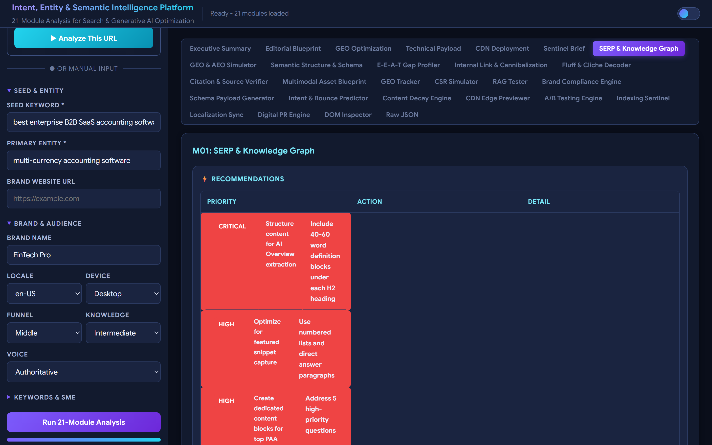
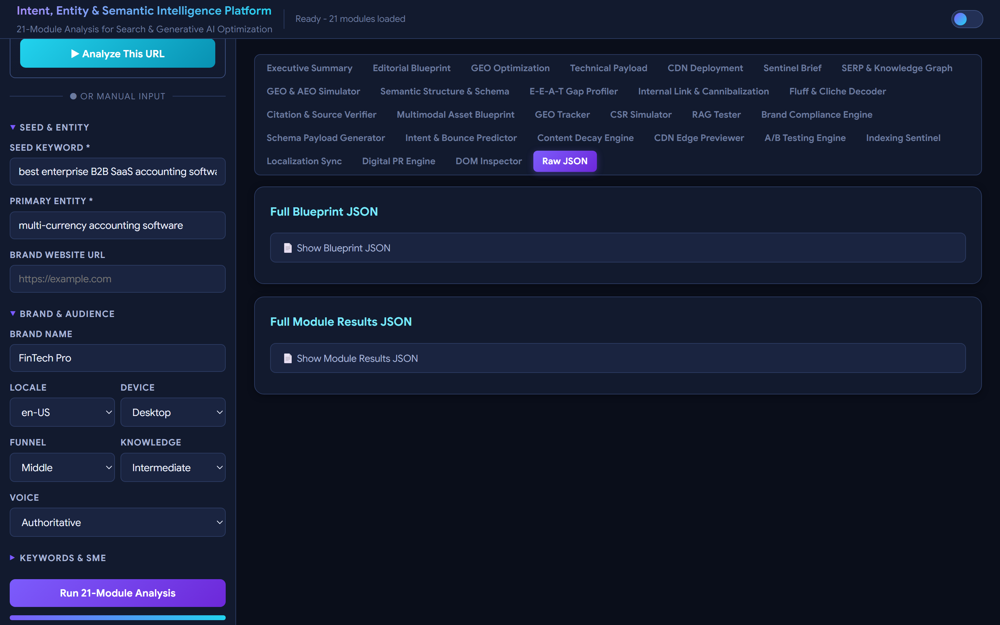

<div align="center">

# Full Time Content Assistant 2026

### Intent, Entity & Semantic Intelligence Platform — a 21-Module Analysis Engine for Search & Generative AI Optimization (GEO/AEO)

[](https://www.python.org/)
[](https://flask.palletsprojects.com/)
[](https://www.reportlab.com/)
[](https://www.microsoft.com/windows)
[](LICENSE)
[](https://github.com/dipakjad1993/Full-Time-Content-Assistant-2026)

*A comprehensive, production-grade web tool that analyzes any content — or a published URL — across 21 specialized SEO, Entity, and Generative Engine Optimization dimensions, then delivers a full blueprint report you can download as a PDF or email to a verified address.*

</div>

---

## 📸 Real Screenshots of the Tool

> Screenshots below are **real captures** of the tool running live with actual analysis data.

### Landing Page — Welcome, Mode Selection & Input Panel


### Executive Summary — After a Real 21-Module Analysis
The Executive Summary tab shows the report overview stats (modules executed, critical issues, high-priority actions, total recommendations), the **Export & Share Report** card, and the URL analysis banner when a published URL is analyzed.


### Module Detail View — SERP & Knowledge Graph (M01)
Every module renders its live fields, stat boxes, recommendations, implementation steps, "where to add" guidance, and a collapsible detailed analysis, with issues automatically highlighted in red.


### Raw JSON Export — Complete Programmatic Data
The Raw JSON tab exposes the full Blueprint JSON and full Module Results JSON, ready to copy for programmatic use.


---

## 🚀 What Is This?

**Full Time Content Assistant 2026** is a self-hosted, single-command web application that runs **21 deep-analysis modules** on your target content — either a **seed keyword / primary entity** you type in, or a **published blog/article URL** that the tool fetches and parses live.

Modern content needs to rank in **two** ecosystems simultaneously:

1. **Traditional search engines** (Google, Bing) — schema markup, E-E-A-T, internal links, freshness, indexing.
2. **Generative AI engines** (ChatGPT, Gemini, Perplexity) — Retrieval-Augmented Generation (RAG) chunking, direct-answer blocks, citation triggers, entity grounding.

Most tools only address one. This platform is built to address **both**, module by module, and to assemble every result into **5 actionable blueprints** plus a complete executive summary.

The tool pulls **real, live data** at run time — SERP results, Wikidata entities, Wayback Machine snapshots, HTTP/robots.txt checks, response headers, CDN detection — so every report reflects the current state of the web, not static templates.

---

## ✨ Key Features

| Feature | Description |
|---|---|
| **21 Analysis Modules** | Deep, specialized analyses from SERP & KG to DOM Inspector, each with recommendations, steps and issue detection |
| **5 Blueprint Outputs** | Editorial, GEO/AEO, Technical, CDN/Edge, and Sentinel monitoring blueprints compiled into one actionable plan |
| **Executive Summary** | Overview stats, critical issues, high-priority actions, total recommendations |
| **Two Analysis Modes** | Keyword/Entity mode **and** live Published-URL mode (fetches + parses the page automatically) |
| **Real Data Integration** | Live SERP, Wikidata lookup, Wayback Machine, robots.txt, HTTP status, server headers, CDN detection |
| **Automatic Issue Highlighting** | `NOT_CONFIGURED`, `MISSING`, `INVALID`, `FAILED` and similar values are flagged red throughout the UI |
| **PDF Report Export** | One-click download of the entire analysis as a professionally formatted, page-numbered PDF |
| **Email Report via OTP** | Send the PDF to your own email behind a **6-digit one-time-password verification layer** (anti-abuse) |
| **Dark / Light Theme** | Google Sans (Pixel smartphone font) UI with a vibrant violet–cyan theme and a light mode |
| **Full JSON Export** | Complete blueprint + module data for programmatic workflows |
| **Keyword-Error Honesty** | Text-dependent modules clearly return `No text provided` errors instead of fabricating content |

---

## 🧩 The 21 Analysis Modules

| Module | Name | What It Analyzes |
|---|---|---|
| **M01** | SERP & Knowledge Graph | SERP features (PAA, featured snippets), real ranking results, entity graph and live Wikidata Knowledge-Panel matching |
| **M02** | GEO & AEO Simulator | Generative/Answer Engine optimization strategies, Q&A simulation |
| **M03** | Semantic Structure & Schema | Heading hierarchy, semantic HTML structure, schema validation |
| **M04** | E-E-A-T Gap Profiler | Experience, Expertise, Authoritativeness, Trustworthiness gaps |
| **M05** | Internal Link & Cannibalization | Keyword cannibalization risk, internal link architecture (with live link-health checks) |
| **M06** | Fluff & Cliche Decoder | Filler content, clichés, and non-original phrase detection |
| **M07** | Citation & Source Verifier | Citation accuracy and source credibility for E-E-A-T signals (live URL verification) |
| **M08** | Multimodal Asset Blueprint | Images, videos, infographics, and interactive asset planning |
| **M09** | GEO Tracker | Performance tracking across AI platforms |
| **M10** | CSR Simulator | Client-Side Rendering impact on indexing |
| **M11** | RAG Tester | Retrieval-Augmented Generation compatibility and chunking |
| **M12** | Brand Compliance Engine | Brand voice, terminology, and style enforcement |
| **M13** | Schema Payload Generator | Complete JSON-LD schema payloads for rich results |
| **M14** | Intent & Bounce Predictor | Bounce risk and user-intent alignment |
| **M15** | Content Decay Engine** | Freshness decay detection and refresh briefs (uses real Wayback Machine history) |
| **M16** | CDN Edge Previewer | Edge-injected schema, headers, pre-rendered HTML (live server-header inspection) |
| **M17** | A/B Testing Engine | Statistical A/B test design with real sample-size math |
| **M18** | Indexing Sentinel | Indexing status and crawl-budget health (live robots.txt / HTTP checks) |
| **M19** | Localization Sync | hreflang, localized schema, entity mapping |
| **M20** | Digital PR Engine | PR outreach, authority signals, brand mentions (live outlet discovery) |
| **M21** | DOM Inspector | DOM structure, layout shifts, performance impact |

---

## 🗂 The 5 Blueprint Outputs

1. **Executive Summary** — headline stats + all critical issues and high-priority actions.
2. **Editorial & Writing Blueprint** — H1/H2/H3 outline, word targets, direct-answer blocks, SME quote placements, information-gain checklist, unique value propositions, quality targets and content flow.
3. **GEO & AEO Optimization** — geo-readiness score, RAG-optimized chunk plan, answer-block strategy per engine, citation triggers and required citation sources.
4. **Technical Payload** — JSON-LD schema payloads (view/copy per type), schema validation, internal-linking blueprint, search-engine coverage, cannibalization and hallucination risk.
5. **CDN & Edge Deployment** — edge-worker snippet, server-header inspection table, pre-render simulation, CDN config, deployment guide.
6. **Post-Publish Sentinel Brief** — monitoring targets per engine, alert system, indexing checks, content refresh brief, rollback guardrails.

---

## 📄 Export & Share: Download PDF / Email with OTP Verification

After any analysis completes, an **Export & Share Report** card appears at the top of the Executive Summary:

### ➡️ Download PDF Report
Generates the entire report as a **professionally formatted PDF** — executive summary, all 5 blueprints, every module, plus a full JSON appendix — with page numbers, a branded footer, proper page breaks, and styled tables. Downloads instantly with a timestamped filename.

### ➡️ Email Me the PDF (OTP-verified)
The tool can email the PDF to the user's own inbox through an anti-abuse **verification layer**:

1. You enter your email and click **Send OTP**.
2. The tool emails a **6-digit one-time password** to that address.
3. You enter the OTP in the tool and click **Verify & Send PDF**.
4. Only a **correct, non-expired, single-use** OTP triggers the PDF email — the report is sent to the verified address automatically.

**Security model (anti-gaming / anti-abuse):**

| Control | Setting |
|---|---|
| OTP validity | 10 minutes |
| OTP usage | Single-use (replay is rejected) |
| Wrong attempts | 5 max per request (then OTP invalidated) |
| Send frequency | Max 3 OTP requests per email per 10 minutes |
| Email validation | Strict RFC-ish regex on the server |
| SMTP credentials | Never hard-coded — stored in `mail_config.json` (git-ignored) or environment variables |

---

## 🛠 Tech Stack

- **Python 3.13** — backend engine + server
- **Flask 3** — web server & REST API
- **ReportLab 4** — professional PDF report generation (Segoe UI fonts, styled tables, page numbers)
- **Requests** — live HTTP/web data fetching
- **Standard Library** — `smtplib`/`email` for OTP & report email, `html.parser` for URL content extraction
- **Vanilla JS + CSS** — fast, dependency-free front end with Google Sans (Pixel) font and dark/light themes

---

## 🏗 Architecture & How It Works

```
┌─────────────────────────────┐
│   Browser (Flask UI)        │
│   - Input panel (2 modes)   │
│   - Render tabs / panels    │
│   - Export & Share card     │
└──────────┬──────────────────┘
           │ POST /api/analyze | /api/analyze-url
┌──────────▼──────────────────┐
│  PlatformEngine             │  intent_entity_platform/core/engine.py
│  run_analysis(InputFramework)│
│  -> orchestrates 21 modules │
└──────────┬──────────────────┘
           │
┌──────────▼──────────────────┐
│  input_framework            │  validated, typed inputs
│  SeedKeywordInput, Brand…   │
└──────────┬──────────────────┘
           │
┌──────────▼────────────────────────────────────┐
│  21 Modules (modules/module_XX_*.py)          │
│  M01 SERP/KG .. M21 DOM Inspector            │
│  + utils/web_data.py (live SERP, Wikidata,   │
│    Wayback, robots.txt, headers, link health)│
└──────────┬────────────────────────────────────┘
           │
┌──────────▼──────────────────┐
│  output_pipeline            │  honest executive summary,
│  -> 5 blueprints + summary  │  derived from real results
└──────────┬──────────────────┘
           │
┌──────────▼───────────────────────────────────────────┐
│  Server extras (server.py)                          │
│  PDF builder (reportlab) | SMTP + OTP store |       │
│  /api/download_pdf, /api/send_otp,                  │
│  /api/verify_and_send_report, /api/analyze(-url)    │
└─────────────────────────────────────────────────────┘
```

---

## 📁 Project Structure

```
Full-Time-Content-Assistant-2026/
├── server.py                      # Flask server, UI (HTML/CSS/JS), PDF + OTP endpoints
├── mail_config.json               # SMTP credentials (GIT-IGNORED — create from example)
├── mail_config.example.json       # SMTP config template (committed)
├── requirements.txt               # Python dependencies
├── README.md                      # This file
├── screenshots/                   # Real UI screenshots used in this README
│   ├── landing.png
│   ├── results-exec.png
│   ├── results-module.png
│   └── results-raw.png
└── intent_entity_platform/
    ├── core/
    │   ├── engine.py              # PlatformEngine orchestration
    │   ├── input_framework.py     # Typed, validated input models
    │   └── output_pipeline.py     # Blueprint + executive summary assembly
    ├── modules/                   # module_01_*.py … module_21_*.py
    └── utils/
        └── web_data.py            # Live data: SERP, Wikidata, Wayback, robots, headers, links
```

---

## ⚙️ Installation & Setup

### Prerequisites
- **Python 3.13+** installed and on `PATH`
- **Git** (optional, for cloning)
- Internet connection (for live data + SMTP email)

### 1. Clone & install
```bash
git clone https://github.com/dipakjad1993/Full-Time-Content-Assistant-2026.git
cd Full-Time-Content-Assistant-2026

# (recommended) create a virtual environment
python -m venv .venv
.venv\Scripts\activate            # Windows
# source .venv/bin/activate       # macOS / Linux

pip install -r requirements.txt
```

### 2. Configure email (optional — only needed for the OTP email feature)
```bash
copy mail_config.example.json mail_config.json
```
Then open `mail_config.json` and fill in your SMTP settings, **or** set the equivalent environment variables:

| Setting | Env var | Example (Gmail) |
|---|---|---|
| `smtp_host` | `SMTP_HOST` | `smtp.gmail.com` |
| `smtp_port` | `SMTP_PORT` | `587` |
| `smtp_user` | `SMTP_USER` | `you@gmail.com` |
| `smtp_pass` | `SMTP_PASS` | a 16-char Gmail **App Password** |
| `smtp_from` | `SMTP_FROM` | `you@gmail.com` |
| `smtp_use_tls` | `SMTP_USE_TLS` | `true` |

> **Gmail notes:** enable 2-Step Verification, create an **App Password**, and use `smtp.gmail.com` / port `587`. Never commit your real `mail_config.json` — it is git-ignored.

### 3. Run the tool
```bash
python server.py
```
Open **http://localhost:5000** in your browser.

---

## 🎯 Usage Guide

### Mode A — Analyze a Published URL
1. In the sidebar, paste a **published blog/article URL** (e.g. `https://example.com/blog/your-article`).
2. Optionally enter a brand name.
3. Click **▶ Analyze This URL**.
4. The tool fetches the page live (title, meta, H1/H2s, word count, links, images, schema presence) and runs all 21 modules against it. A **URL Analysis banner** with the live page stats appears at the top of the results.

### Mode B — Manual Keyword / Entity Analysis
1. Enter a **Seed Keyword** and a **Primary Entity** (required).
2. Optional: brand website, brand name, locale, device, funnel stage, knowledge level, voice, secondary keywords, blacklisted terms, SME notes.
3. Click **Run 21-Module Analysis** and watch the live module-progress dots.
4. Browse the results via the **tab bar**: Executive Summary → Editorial → GEO → Technical → CDN → Sentinel → M01…M21 → Raw JSON.

### Exporting the report
- **Download PDF** — click the button in the Export & Share card.
- **Email the PDF** — enter your email → **Send OTP** → enter the OTP from your inbox → **Verify & Send PDF**. The PDF lands in your verified inbox only.

---

## 🔌 API Reference

| Method | Endpoint | Description |
|---|---|---|
| `POST` | `/api/analyze` | Run a full 21-module analysis from keyword/entity inputs |
| `POST` | `/api/analyze-url` | Fetch a URL, extract content, and run the full analysis on it |
| `POST` | `/api/download_pdf` | Generate the full report as a PDF (`{report: <results>}`) |
| `POST` | `/api/send_otp` | Send a 6-digit OTP to an email (`{email: "..."}`) |
| `POST` | `/api/verify_and_send_report` | Verify OTP and email the report PDF (`{email, otp, report}`) |
| `GET` | `/` | Serve the web UI |

---

## 🌐 Real-Data Sources Used at Runtime

- **Live SERP** (DuckDuckGo HTML) — result positions, titles, URLs, snippets, People-Also-Ask features.
- **Wikidata** — real entity Q-IDs for Knowledge-Graph matching (`wikidata_verified`).
- **Wayback Machine CDX API** — content freshness / decay snapshots (retries with backoff).
- **HTTP checks** — page status, robots.txt rules, readiness score, sitemap detection.
- **Response headers** — server technology + CDN detection (case-insensitive, honest `not_detected` fallback).
- **Link health** — live reachability checks for citation/internal URLs.

---

## 🔒 OTP Anti-Abuse Design (Details)

- OTPs are **6-digit**, single-use, and stored **in memory only** (never logged, never persisted).
- Each OTP record enforces: 10-min TTL, 5 max verification attempts, and a 3-requests-per-10-minutes throttle per address.
- Wrong attempts return a friendly remaining-attempts message; reaching the cap invalidates the OTP.
- The report PDF is generated **only after** successful verification, and sent to the exact verified address.
- The download endpoint is intentionally unauthenticated (it delivers to the local user running the tool), while the **email** path is the one protected by OTP — so no one can spam reports to arbitrary mailboxes.

---

## 🧪 Validation & Honesty

- The engine is validated end-to-end against live targets (e.g. Wikipedia "Customer Relationship Management": all 21 modules complete, live SERP/Wikidata/Wayback/robots/header values confirmed).
- **No fabricated numbers**: stat boxes, health scores, and the executive summary's module-health counts are derived from the **actual** module results at run time.
- Keyword mode with no text honestly returns `No text provided` errors for text-dependent modules instead of inventing content.
- PDF generation is verified to produce clean page breaks, page numbers, and zero margin overflows.

---

## 🐛 Troubleshooting

| Problem | Fix |
|---|---|
| `SMTP is not configured` on Send OTP | Fill `mail_config.json` (or env vars) — see Configuration above |
| Port 5000 already in use | Stop the other process or edit `port=5000` at the bottom of `server.py` |
| Analysis returns module errors | Live data sources can be rate-limited; retry, or check your internet connection |
| PDF download blocked | Some corporate browsers block downloads — allow localhost or try another browser |
| URL fetch fails | The target site may block bots; try a different published URL |

---

## ❓ FAQ

**Is this hosted in the cloud?**
No — it runs locally on your machine (`python server.py`). Your data stays on your computer.

**Do I need to pay for any API keys?**
No. All live data uses public/free endpoints (DuckDuckGo HTML, Wikidata, Wayback CDX, HTTP).

**Can it analyze any language?**
Yes — locale is configurable (en-US, en-GB, de-DE, fr-FR, ja-JP, en-AU, en-IN, es-ES, …).

**How is the OTP email feature protected from abuse?**
See the *OTP Anti-Abuse Design* section — single-use, expiring, throttled, attempt-limited codes.

**Can I export the data programmatically?**
Yes — the Raw JSON tab gives you the complete Blueprint and Module Results JSON.

---

## 🗺 Roadmap (Ideas)

- Scheduled / recurring analyses with diff reports.
- Multi-URL batch analysis.
- CSV export of key metrics.
- Pluggable SMTP providers (SendGrid, Mailgun, AWS SES).
- Team workspaces with role-based access.

---

## 🤝 Contributing

Contributions are welcome! Open an issue or submit a pull request. For feature ideas, check the Roadmap above.

---

## 📄 License

Distributed under the **MIT License**. See `LICENSE` for more information.

---

<div align="center">

**Built with ❤️ for the modern search + generative-AI era.**  
*Rank on Google. Get cited by ChatGPT. Be the answer.*

</div>
